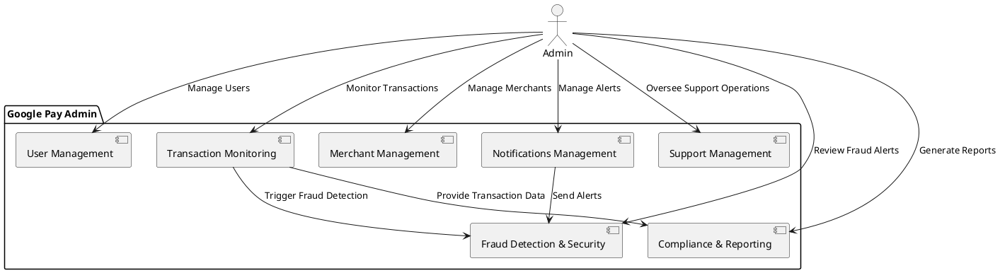
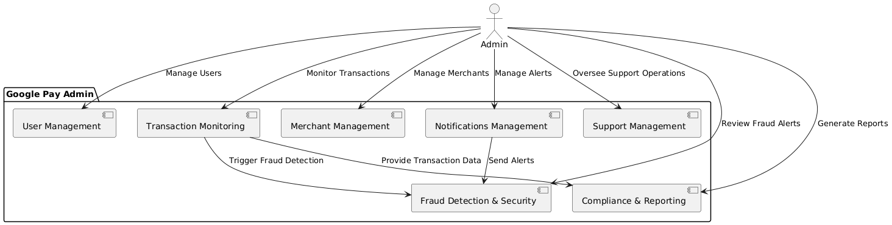
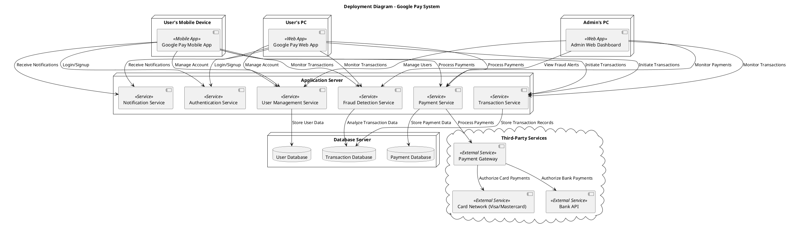
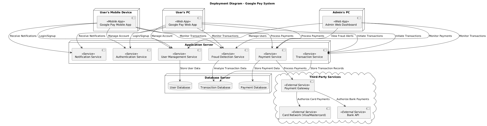

# Google Pay System Diagrams

---

# 1. System Context Diagram - Google Pay

```plantuml
@startuml

' External Actors
actor "User" as User
actor "Merchant" as Merchant
actor "Bank" as Bank
actor "Payment Gateway" as PaymentGateway
actor "Customer Support" as CustomerSupport
actor "Third-Party Apps" as ThirdPartyApps
actor "Regulatory Authorities" as RegulatoryAuthorities
actor "Card Network (Visa/Mastercard)" as CardNetwork

' System Boundary: Google Pay
package "Google Pay" {

    ' Subsystems
    rectangle "User Registration \nand Authentication" as Registration
    rectangle "Bank Account \nand Card Linking" as AccountLinking
    rectangle "Transaction Processing" as Transactions
    rectangle "Payment to Merchants" as MerchantPayments
    rectangle "Peer-to-Peer Transfers" as PeerTransfers
    rectangle "Bill Payments" as BillPayments
    rectangle "Rewards \nand Cashback" as Rewards
    rectangle "Fraud Detection \nand Security" as Security
    rectangle "Notifications \nand Alerts" as Notifications
    rectangle "In-App Support \nand Help" as Support
    rectangle "User Transaction \nand Spending History" as History
}

' Relationships between actors and system components
User --> Registration : Sign Up/Login
User --> AccountLinking : Link Bank/Payment Card
User --> Transactions : Initiate Payment
User --> PeerTransfers : Send/Receive Money
User --> BillPayments : Pay Bills
User --> Rewards : Earn Cashback/Rewards
User --> History : View Transaction History
User --> Notifications : Receive Payment Alerts
User --> Support : Get Help

Merchant --> MerchantPayments : Accept Payment
Merchant --> Notifications : Receive Payment Alerts
Merchant --> Support : Get Help

Bank --> AccountLinking : Verify User Account
Bank --> Transactions : Process Payment
Bank --> MerchantPayments : Settle Merchant Transactions

PaymentGateway --> Transactions : Process Payment Authorization
PaymentGateway --> MerchantPayments : Process Merchant Payment

CardNetwork --> AccountLinking : Verify Card Details
CardNetwork --> Transactions : Process Card Payment

ThirdPartyApps --> PeerTransfers : Initiate Payment Through API
ThirdPartyApps --> Transactions : Use Google Pay for In-App Payments

RegulatoryAuthorities --> Security : Compliance Check and Monitoring

' External Interactions
Transactions --> PaymentGateway : Process Payments
AccountLinking --> Bank : Link Bank Account
AccountLinking --> CardNetwork : Link Payment Card
Notifications --> User : Send Transaction Notifications
Notifications --> Merchant : Send Payment Notifications
Support --> CustomerSupport : Handle User Issues

@enduml


```

# 2. Component Diagram - Google Pay Payment Processing

```plantuml
@startuml

' Component Diagram for Admin in Google Pay System

package "Google Pay Admin" {

    ' Admin Components
    component "User Management" as UserMgmt
    component "Transaction Monitoring" as TxnMonitoring
    component "Fraud Detection & Security" as FraudSecurity
    component "Merchant Management" as MerchantMgmt
    component "Compliance & Reporting" as ComplianceReporting
    component "Notifications Management" as NotificationsMgmt
    component "Support Management" as SupportMgmt
}

' External Admin Actor
actor "Admin" as Admin

' Relationships between Admin and components
Admin --> UserMgmt : Manage Users
Admin --> TxnMonitoring : Monitor Transactions
Admin --> FraudSecurity : Review Fraud Alerts
Admin --> MerchantMgmt : Manage Merchants
Admin --> ComplianceReporting : Generate Reports
Admin --> NotificationsMgmt : Manage Alerts
Admin --> SupportMgmt : Oversee Support Operations

' Relationships between components
TxnMonitoring --> FraudSecurity : Trigger Fraud Detection
TxnMonitoring --> ComplianceReporting : Provide Transaction Data
NotificationsMgmt --> FraudSecurity : Send Alerts

@enduml

```

# 3. Deployment Diagram - Google Pay

```plantuml
@startuml
title Deployment Diagram - Google Pay System

' Nodes
node "User's Mobile Device" {
    [Google Pay Mobile App] <<Mobile App>>
}

node "User's PC" {
    [Google Pay Web App] <<Web App>>
}

node "Admin's PC" {
    [Admin Web Dashboard] <<Web App>>
}

node "Application Server" {
    [Authentication Service] <<Service>>
    [Transaction Service] <<Service>>
    [Payment Service] <<Service>>
    [Fraud Detection Service] <<Service>>
    [Notification Service] <<Service>>
    [User Management Service] <<Service>>
}

node "Database Server" {
    database "User Database" as UserDB
    database "Transaction Database" as TxnDB
    database "Payment Database" as PaymentDB
}

cloud "Third-Party Services" {
    [Payment Gateway] <<External Service>>
    [Card Network (Visa/Mastercard)] <<External Service>>
    [Bank API] <<External Service>>
}

' Connections
[Google Pay Mobile App] --> [Authentication Service] : "Login/Signup"
[Google Pay Mobile App] --> [Transaction Service] : "Initiate Transactions"
[Google Pay Mobile App] --> [Payment Service] : "Process Payments"
[Google Pay Mobile App] --> [Fraud Detection Service] : "Monitor Transactions"
[Google Pay Mobile App] --> [Notification Service] : "Receive Notifications"
[Google Pay Mobile App] --> [User Management Service] : "Manage Account"

[Google Pay Web App] --> [Authentication Service] : "Login/Signup"
[Google Pay Web App] --> [Transaction Service] : "Initiate Transactions"
[Google Pay Web App] --> [Payment Service] : "Process Payments"
[Google Pay Web App] --> [Fraud Detection Service] : "Monitor Transactions"
[Google Pay Web App] --> [Notification Service] : "Receive Notifications"
[Google Pay Web App] --> [User Management Service] : "Manage Account"

[Admin Web Dashboard] --> [User Management Service] : "Manage Users"
[Admin Web Dashboard] --> [Transaction Service] : "Monitor Transactions"
[Admin Web Dashboard] --> [Payment Service] : "Monitor Payments"
[Admin Web Dashboard] --> [Fraud Detection Service] : "View Fraud Alerts"

[Transaction Service] --> TxnDB : "Store Transaction Records"
[User Management Service] --> UserDB : "Store User Data"
[Payment Service] --> PaymentDB : "Store Payment Data"
[Fraud Detection Service] --> TxnDB : "Analyze Transaction Data"

[Payment Service] --> [Payment Gateway] : "Process Payments"
[Payment Gateway] --> [Card Network (Visa/Mastercard)] : "Authorize Card Payments"
[Payment Gateway] --> [Bank API] : "Authorize Bank Payments"

@enduml

```
