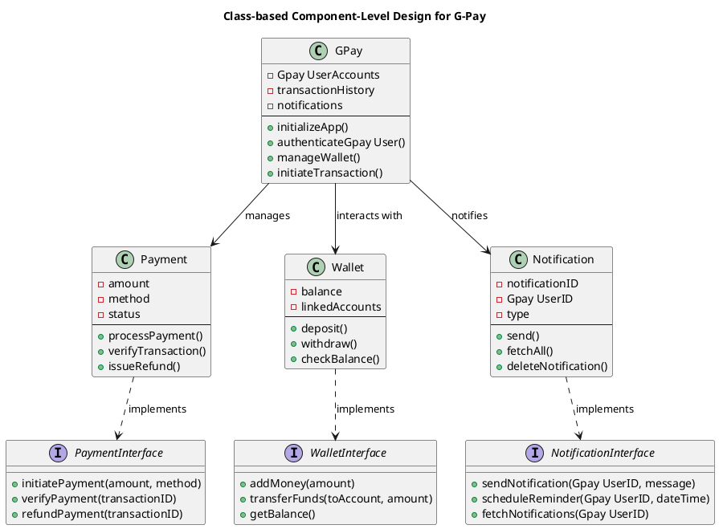
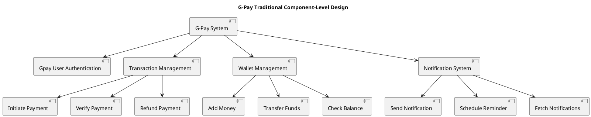

# Google Pay System Diagrams


# C4 Model for Visualising Software Architecture


# Levels of System Design

## Level 1: Context
At this level, the focus is on the big picture, showing how the system interacts with users and external systems. It highlights the system's purpose and boundaries.

## Level 2: Containers
This level zooms in to show the different containers (applications, services, databases, etc.) that make up the system. It demonstrates how the system's components communicate internally and externally.

## Level 3: Components
At the component level, the diagram zooms further into one container to illustrate its internal structure. It identifies key components, their responsibilities, and how they interact within the container.

## Level 4: Code
The final level shows the implementation details of a specific component, such as class diagrams or code structure, providing a deep dive into how the component is built.
---


# 1. System Context Diagram - Google Pay

```
@startuml
title System Context Diagram for Google Pay

actor Gpay User as U
actor Merchant as M
actor Bank as B
actor PaymentNetwork as PN

package "Google Pay System" {
    [Google Pay Mobile App] as GPApp
    [Google Pay Backend Services] as GPBackend
}

U --> GPApp : Makes Payment Request
M <-- GPApp : Payment Confirmation
GPApp --> GPBackend : Sends Payment Details
GPBackend --> PN : Routes Payment
PN --> B : Processes Transaction
B --> PN : Sends Transaction Status
PN --> GPBackend : Updates Payment Status
GPBackend --> GPApp : Notifies Payment Status
GPApp --> U : Displays Payment Status

@enduml


```


### Description  
- **Gpay Users**:  
  - **Retail investors**: Interact with the Google Pay app to make payments.  
  - **Merchants**: Receive payments through the Google Pay app.  
- **External Systems**:  
  - **Payment Networks**: Handle routing and processing of payments to banks.  
  - **Banks**: Process the financial transactions.  
- **Components**:  
  - **Google Pay Mobile App**: Allows Gpay Users to initiate payments and receive payment statuses.  
  - **Google Pay Backend Services**: Handles routing payment requests and updating the status.  

---

# 2. Container Diagram 

```plantuml

@startuml
actor "Gpay User" as Gpay User
actor "Merchant" as Merchant
actor "Admin" as Admin

package "Frontend Layer" {
    [GPay App (Web/Mobile)] as Frontend
}

package "Backend Layer" {
    [Backend API] as BackendAPI
    [Gpay User Management Service] as Gpay UserService
    [Payment Processing Service] as PaymentService
    [Notification Service] as NotificationService
    [Analytics Service] as AnalyticsService
}

package "External Services Layer" {
    [Banking API] as BankingAPI
    [Merchant Gateway] as MerchantGateway
    [Notification Provider] as NotificationProvider
}

package "Data Layer" {
    [Gpay User Database] as Gpay UserDB
    [Transaction Database] as TransactionDB
    [Merchant Database] as MerchantDB
}

Gpay User --> Frontend : Login, Add Cards, Make Payments
Merchant --> Frontend : Receive Payments
Admin --> BackendAPI : Manage Gpay Users, Transactions

Frontend --> BackendAPI : API Requests
BackendAPI --> Gpay UserService : Gpay User Authentication
BackendAPI --> PaymentService : Payment Processing
BackendAPI --> NotificationService : Notifications
BackendAPI --> AnalyticsService : Usage Analytics

PaymentService --> BankingAPI : Process Transactions
PaymentService --> MerchantGateway : Route Merchant Payments

NotificationService --> NotificationProvider : Push Notifications

Gpay UserService --> Gpay UserDB : Save/Update Gpay User Info
PaymentService --> TransactionDB : Save Transactions
MerchantGateway --> MerchantDB : Log Merchant Data
@enduml

```


### Description  
- **Gpay Users**:  
  - **Retail investors**: Use the mobile app to log in, add payment methods, and make payments.  
  - **Merchants**: Receive payments through the app interface.  
  - **Admins**: Manage Gpay Users and transaction data through the backend API.  
- **External Systems**:  
  - **Banking API**: Handles transaction processing with banks.  
  - **Merchant Gateway**: Routes merchant payments for completion.  
  - **Notification Provider**: Sends notifications about transaction statuses.  
- **Components**:  
  - **Frontend Layer**: The **Google Pay App** (mobile/web) allows Gpay User interaction.  
  - **Backend Layer**: Includes various services like **Gpay User Management**, **Payment Processing**, **Notification Service**, and **Analytics Service** that interact with databases and external APIs.  
  - **Data Layer**: Stores Gpay User, transaction, and merchant data.  

---


# 3. Component Diagram - Google Pay Payment Processing







### Description  
- **Gpay Users**:  
  - **Retail investors**: Use the app to manage payments, fund transfers, and view notifications.  
- **External Systems**:  
  - **None explicitly**: The diagram focuses on internal components.  
- **Components**:  
  - **GPay**: The main class that interacts with Gpay Users, manages accounts, and processes transactions.  
  - **Payment**, **Wallet**, and **Notification** classes handle specific operations like initiating payments, managing balances, and sending notifications.  
  - **Interfaces**: Abstract operations for payments, wallet management, and notifications, allowing easy integration and operation with the underlying system.

---


# 4. Deployment Diagram - Google Pay

```plantuml
@startuml
title Deployment Diagram - Google Pay System

' Nodes
node "Gpay User's Mobile Device" {
    [Google Pay Mobile App] <<Mobile App>>
}

node "Gpay User's PC" {
    [Google Pay Web App] <<Web App>>
}

node "Admin's PC" {
    [Admin Web Dashboard] <<Web App>>
}

node "Application Server" {
    [Authentication Service] <<Service>>
    [Transaction Service] <<Service>>
    [Payment Service] <<Service>>
    [Fraud Detection Service] <<Service>>
    [Notification Service] <<Service>>
    [Gpay User Management Service] <<Service>>
}

node "Database Server" {
    database "Gpay User Database" as Gpay UserDB
    database "Transaction Database" as TxnDB
    database "Payment Database" as PaymentDB
}

cloud "Third-Party Services" {
    [Payment Gateway] <<External Service>>
    [Card Network (Visa/Mastercard)] <<External Service>>
    [Bank API] <<External Service>>
}

' Connections
[Google Pay Mobile App] --> [Authentication Service] : "Login/Signup"
[Google Pay Mobile App] --> [Transaction Service] : "Initiate Transactions"
[Google Pay Mobile App] --> [Payment Service] : "Process Payments"
[Google Pay Mobile App] --> [Fraud Detection Service] : "Monitor Transactions"
[Google Pay Mobile App] --> [Notification Service] : "Receive Notifications"
[Google Pay Mobile App] --> [Gpay User Management Service] : "Manage Account"

[Google Pay Web App] --> [Authentication Service] : "Login/Signup"
[Google Pay Web App] --> [Transaction Service] : "Initiate Transactions"
[Google Pay Web App] --> [Payment Service] : "Process Payments"
[Google Pay Web App] --> [Fraud Detection Service] : "Monitor Transactions"
[Google Pay Web App] --> [Notification Service] : "Receive Notifications"
[Google Pay Web App] --> [Gpay User Management Service] : "Manage Account"

[Admin Web Dashboard] --> [Gpay User Management Service] : "Manage Gpay Users"
[Admin Web Dashboard] --> [Transaction Service] : "Monitor Transactions"
[Admin Web Dashboard] --> [Payment Service] : "Monitor Payments"
[Admin Web Dashboard] --> [Fraud Detection Service] : "View Fraud Alerts"

[Transaction Service] --> TxnDB : "Store Transaction Records"
[Gpay User Management Service] --> Gpay UserDB : "Store Gpay User Data"
[Payment Service] --> PaymentDB : "Store Payment Data"
[Fraud Detection Service] --> TxnDB : "Analyze Transaction Data"

[Payment Service] --> [Payment Gateway] : "Process Payments"
[Payment Gateway] --> [Card Network (Visa/Mastercard)] : "Authorize Card Payments"
[Payment Gateway] --> [Bank API] : "Authorize Bank Payments"

@enduml

```


### Description  
- **Gpay Users**:  
  - **Retail investors**: Access Google Pay through either mobile or web apps to make payments and manage accounts.  
  - **Admins**: Use the Admin Web Dashboard to monitor transactions, manage Gpay Users, and view fraud alerts.  
- **External Systems**:  
  - **Payment Gateway**: Routes payment processing requests to card networks and banks.  
  - **Card Network (Visa/Mastercard)**: Authorizes card transactions.  
  - **Bank API**: Authorizes and processes bank payments.  
- **Components**:  
  - **Gpay User's Mobile Device & PC**: Host the **Google Pay Mobile App** and **Google Pay Web App** for Gpay User interaction.  
  - **Application Server**: Runs services like **Authentication**, **Payment**, **Fraud Detection**, **Notification**, and **Gpay User Management**.  
  - **Database Server**: Hosts databases for Gpay User, transaction, and payment data.  
  - **Third-Party Services**: Handle payment authorization and processing.
