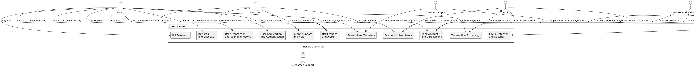
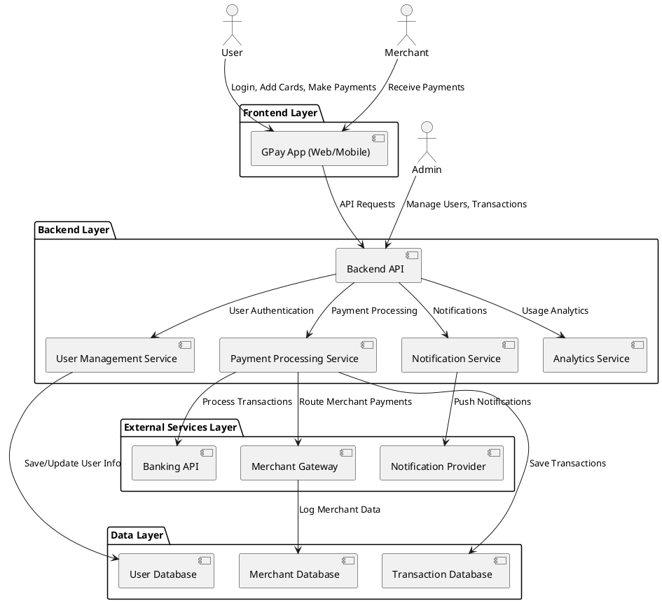
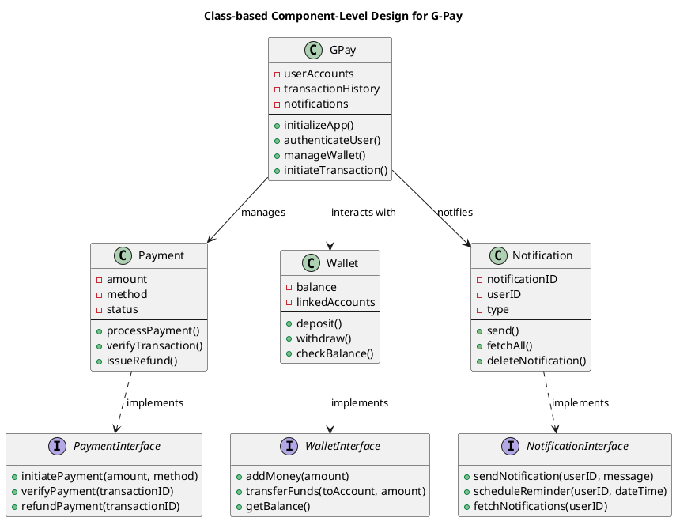
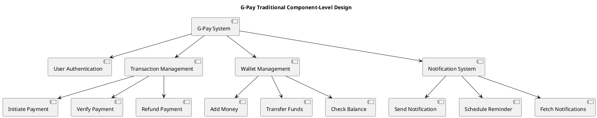
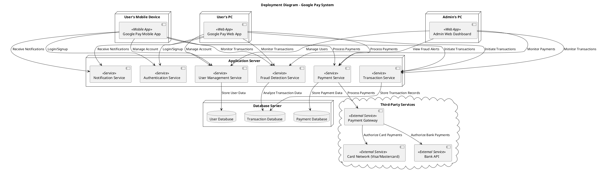

# Google Pay System Diagrams

---

# 1. System Context Diagram - Google Pay

```plantuml
@startuml

' External Actors
actor "User" as User
actor "Merchant" as Merchant
actor "Bank" as Bank
actor "Payment Gateway" as PaymentGateway
actor "Customer Support" as CustomerSupport
actor "Third-Party Apps" as ThirdPartyApps
actor "Regulatory Authorities" as RegulatoryAuthorities
actor "Card Network (Visa/Mastercard)" as CardNetwork

' System Boundary: Google Pay
package "Google Pay" {

    ' Subsystems
    rectangle "User Registration \nand Authentication" as Registration
    rectangle "Bank Account \nand Card Linking" as AccountLinking
    rectangle "Transaction Processing" as Transactions
    rectangle "Payment to Merchants" as MerchantPayments
    rectangle "Peer-to-Peer Transfers" as PeerTransfers
    rectangle "Bill Payments" as BillPayments
    rectangle "Rewards \nand Cashback" as Rewards
    rectangle "Fraud Detection \nand Security" as Security
    rectangle "Notifications \nand Alerts" as Notifications
    rectangle "In-App Support \nand Help" as Support
    rectangle "User Transaction \nand Spending History" as History
}

' Relationships between actors and system components
User --> Registration : Sign Up/Login
User --> AccountLinking : Link Bank/Payment Card
User --> Transactions : Initiate Payment
User --> PeerTransfers : Send/Receive Money
User --> BillPayments : Pay Bills
User --> Rewards : Earn Cashback/Rewards
User --> History : View Transaction History
User --> Notifications : Receive Payment Alerts
User --> Support : Get Help

Merchant --> MerchantPayments : Accept Payment
Merchant --> Notifications : Receive Payment Alerts
Merchant --> Support : Get Help

Bank --> AccountLinking : Verify User Account
Bank --> Transactions : Process Payment
Bank --> MerchantPayments : Settle Merchant Transactions

PaymentGateway --> Transactions : Process Payment Authorization
PaymentGateway --> MerchantPayments : Process Merchant Payment

CardNetwork --> AccountLinking : Verify Card Details
CardNetwork --> Transactions : Process Card Payment

ThirdPartyApps --> PeerTransfers : Initiate Payment Through API
ThirdPartyApps --> Transactions : Use Google Pay for In-App Payments

RegulatoryAuthorities --> Security : Compliance Check and Monitoring

' External Interactions
Transactions --> PaymentGateway : Process Payments
AccountLinking --> Bank : Link Bank Account
AccountLinking --> CardNetwork : Link Payment Card
Notifications --> User : Send Transaction Notifications
Notifications --> Merchant : Send Payment Notifications
Support --> CustomerSupport : Handle User Issues

@enduml


```

# 2. Container Diagram 

# 3. Component Diagram - Google Pay Payment Processing

# 3. Deployment Diagram - Google Pay

