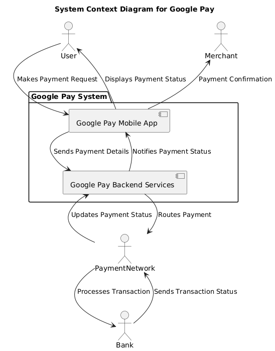

# Google Pay System Diagrams

---

# 1. System Context Diagram - Google Pay

```
@startuml
title System Context Diagram for Google Pay

actor User as U
actor Merchant as M
actor Bank as B
actor PaymentNetwork as PN

package "Google Pay System" {
    [Google Pay Mobile App] as GPApp
    [Google Pay Backend Services] as GPBackend
}

U --> GPApp : Makes Payment Request
M <-- GPApp : Payment Confirmation
GPApp --> GPBackend : Sends Payment Details
GPBackend --> PN : Routes Payment
PN --> B : Processes Transaction
B --> PN : Sends Transaction Status
PN --> GPBackend : Updates Payment Status
GPBackend --> GPApp : Notifies Payment Status
GPApp --> U : Displays Payment Status

@enduml


```




### Description  
- **Users**:  
  - **Retail investors**: Interact with the Google Pay app to make payments.  
  - **Merchants**: Receive payments through the Google Pay app.  
- **External Systems**:  
  - **Payment Networks**: Handle routing and processing of payments to banks.  
  - **Banks**: Process the financial transactions.  
- **Components**:  
  - **Google Pay Mobile App**: Allows users to initiate payments and receive payment statuses.  
  - **Google Pay Backend Services**: Handles routing payment requests and updating the status.  

---

# 2. Container Diagram 


### Description  
- **Users**:  
  - **Retail investors**: Use the mobile app to log in, add payment methods, and make payments.  
  - **Merchants**: Receive payments through the app interface.  
  - **Admins**: Manage users and transaction data through the backend API.  
- **External Systems**:  
  - **Banking API**: Handles transaction processing with banks.  
  - **Merchant Gateway**: Routes merchant payments for completion.  
  - **Notification Provider**: Sends notifications about transaction statuses.  
- **Components**:  
  - **Frontend Layer**: The **Google Pay App** (mobile/web) allows user interaction.  
  - **Backend Layer**: Includes various services like **User Management**, **Payment Processing**, **Notification Service**, and **Analytics Service** that interact with databases and external APIs.  
  - **Data Layer**: Stores user, transaction, and merchant data.  

---


# 3. Component Diagram - Google Pay Payment Processing


### Description  
- **Users**:  
  - **Retail investors**: Use the app to manage payments, fund transfers, and view notifications.  
- **External Systems**:  
  - **None explicitly**: The diagram focuses on internal components.  
- **Components**:  
  - **GPay**: The main class that interacts with users, manages accounts, and processes transactions.  
  - **Payment**, **Wallet**, and **Notification** classes handle specific operations like initiating payments, managing balances, and sending notifications.  
  - **Interfaces**: Abstract operations for payments, wallet management, and notifications, allowing easy integration and operation with the underlying system.

---


# 3. Deployment Diagram - Google Pay


### Description  
- **Users**:  
  - **Retail investors**: Access Google Pay through either mobile or web apps to make payments and manage accounts.  
  - **Admins**: Use the Admin Web Dashboard to monitor transactions, manage users, and view fraud alerts.  
- **External Systems**:  
  - **Payment Gateway**: Routes payment processing requests to card networks and banks.  
  - **Card Network (Visa/Mastercard)**: Authorizes card transactions.  
  - **Bank API**: Authorizes and processes bank payments.  
- **Components**:  
  - **User's Mobile Device & PC**: Host the **Google Pay Mobile App** and **Google Pay Web App** for user interaction.  
  - **Application Server**: Runs services like **Authentication**, **Payment**, **Fraud Detection**, **Notification**, and **User Management**.  
  - **Database Server**: Hosts databases for user, transaction, and payment data.  
  - **Third-Party Services**: Handle payment authorization and processing.
