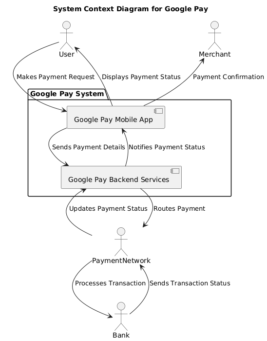
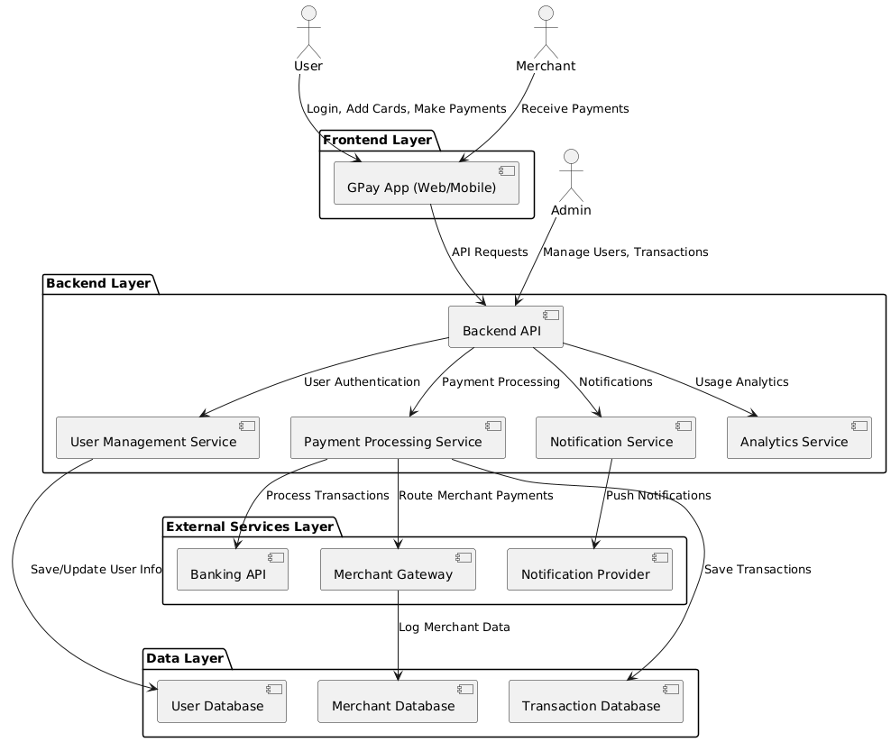
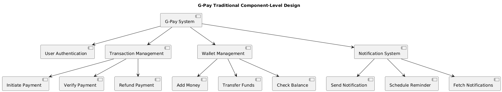
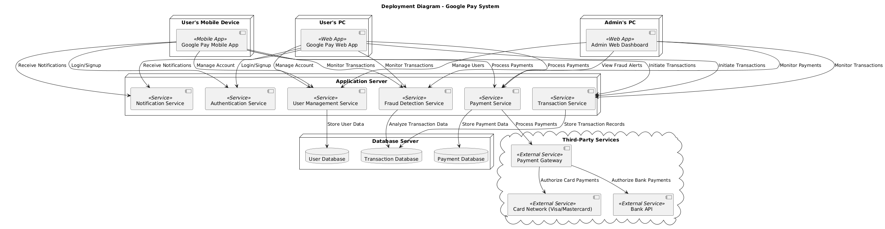
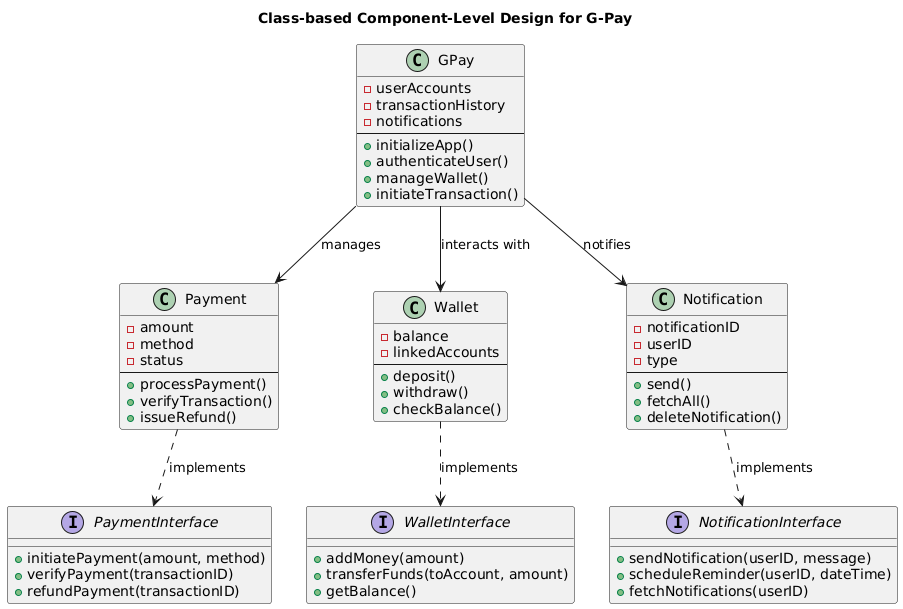

# Cross-Reference Matrix for Google Pay   Project

This matrix maps the **stakeholders**, **requirements**, **architecture/design components**, and **testing scenarios** for the Google Pay   project.

| **Stakeholder/Category**          | **URD Section**                                      | **SRS Section**                                           | **Architecture/Design Topics**                            | **Testing Scenarios**                                           | **Diagram**                    |
|-----------------------------------|-----------------------------------------------------|----------------------------------------------------------|------------------------------------------------------------|--------------------------------------------------------------|--------------------------------|
| **Project Sponsor**               | 1.1 Purpose, 1.2 Scope                              | 1.2 Scope                                                 | System Context Diagram                                      | -                                                            |  |
| **Project Manager**               | 2.5 Assumptions and Dependencies, 2.4 Constraints   | 2.6 Assumptions and Dependencies, 2.4 Constraints        | Microservices Architecture                                  | -                                                            |  |
| **Development Team**              | 3.1–3.6 Functional Requirements                     | 3.1–3.4 System Features                                  | Frontend Layer, Backend Layer, Payment Service, Gpay User Service, Notification Service | Integration Testing, Code Implementation                      |  |
| **UI/UX Designers**               | 2.3 Gpay User Characteristics, 4.3 Usability             | 4.1 Gpay User Interfaces                                       | Frontend Design, Gpay User Interface Mockups                     | UI/UX Testing, Accessibility Testing                          |  |
| **Quality Assurance (QA) Team**   | 3.5 Security and Privacy, 3.6 Customer Support      | 5.3 Availability and Reliability, 5.2 Security Requirements | Notification Service, Fraud Detection Service, Gpay User Management Service | Functional Testing, Security Testing, Load Testing            |  |
| **Product Owner**                 | 1.3 Definitions, 3.1–3.6 Functional Requirements    | 3.1–3.4 System Features                                  | Requirements Matrix                                          | -                                                            | -                              |
| **End Gpay Users (Consumers)**         | 3.1 Gpay User Registration, 3.2 Payment Processing, 3.3 Transaction History, 3.4 Rewards and Offers | 3.1 Gpay User Registration and Authentication, 3.2 Money Transfer, 3.3 Transaction History, 3.4 Rewards & Cashback | Authentication Service, Payment Processing Service, Transaction Management Service, Rewards Management System | Gpay User Registration, Make Payment, View Transaction History, Rewards & Cashback, Notifications |  |
| **Merchants**                     | 2.3 Gpay User Characteristics, 3.2 Payment Processing    | 3.2 Money Transfer                                        | Merchant Gateway, Payment Service, Transaction Database      | Make Payment, Transaction History, Payment Method Addition    |  |
| **Legal and Compliance Team**     | 2.4 Constraints, 4.5 Security                       | 5.7 Compliance                                            | Data Encryption Modules, Fraud Detection Service             | Compliance Testing, Security Audits, Regulatory Compliance Testing |  |
| **Payment Gateway Providers**     | 3.2 Payment Processing, 2.4 Constraints             | 4.4 Communication Interfaces                              | Banking API, Payment Gateway, Transaction Database           | Payment Method Integration, Payment Processing Testing, Bank API Integration |  |
| **Security Team**                 | 3.5 Security and Privacy                            | 5.2 Security Requirements                                 | Fraud Detection Service, Multi-Factor Authentication, Data Encryption Modules | Security Testing, Fraud Detection Testing, Penetration Testing, Compliance Testing |  |
| **Customer Support Team**         | 3.6 Customer Support                                | 4.1 Gpay User Interfaces                                       | Admin Panel, Customer Support Service, Gpay User Management Service | Contacting Customer Support, Issue Resolution, FAQ Testing    |  |
| **Marketing Team**                | 3.4 Rewards and Offers                              | 3.4 Rewards & Cashback                                    | Analytics Service, Marketing Platform                        | Rewards Redemption Testing, Marketing Campaign Testing        |  |

---

### Explanation of Matrix Components

#### **Project Sponsor**  
- **URD Section**: The **purpose (1.1)** and **scope (1.2)** define the overall objectives and boundaries of the project. The sponsor oversees ensuring these objectives align with the business goals.  
- **SRS Section**: The **scope (1.2)** in the SRS elaborates on the deliverables, focusing on high-level expectations.  
- **Architecture/Design Topics**: The **System Context Diagram** illustrates how the Google Pay   integrates with external entities like Gpay Users, merchants, banks, and payment networks.  
- **Testing Scenarios**: Not applicable directly since the sponsor’s role is at the strategic level.  
- **Diagram**: The **System Context Diagram** provides a visual overview of the system's interaction with external stakeholders.  

#### **Project Manager**  
- **URD Section**: **Assumptions (2.5)** and **constraints (2.4)** define the boundaries within which the project manager operates, such as dependencies on third-party APIs or regulatory compliance.  
- **SRS Section**: The corresponding sections in the SRS (2.6 and 2.4) expand on these assumptions, detailing project dependencies like stable internet connections and banking integration.  
- **Architecture/Design Topics**: The **Microservices Architecture** and **Container Diagram** ensure modular design, enabling better resource allocation and management by the project manager.  
- **Testing Scenarios**: Not directly applicable but ensures alignment with testing objectives and deadlines.  
- **Diagram**: The **Container Diagram** visually represents modular components, aiding project planning.  

#### **Development Team**  
- **URD Section**: **Functional requirements (3.1–3.6)** specify the features to be developed, such as registration, payment processing, and rewards.  
- **SRS Section**: **System features (3.1–3.4)** translate these into detailed technical requirements for implementation.  
- **Architecture/Design Topics**: Includes **Frontend and Backend Layers**, **Payment Service**, **Gpay User Service**, and **Notification Service**, defining the components responsible for fulfilling each requirement.  
- **Testing Scenarios**: Focus on **integration testing** to ensure seamless communication between services, along with feature-specific implementation validation.  
- **Diagram**: The **Component Diagram** breaks down these services, guiding development.  

#### **UI/UX Designers**  
- **URD Section**: **Gpay User characteristics (2.3)** and **usability requirements (4.3)** define the expectations for a Gpay User-friendly interface.  
- **SRS Section**: **Gpay User Interfaces (4.1)** elaborate on the technical aspects, like supporting different screen sizes and WCAG 2.1 compliance.  
- **Architecture/Design Topics**: Covers **Frontend Design** and **Gpay User Interface Mockups**, ensuring usability standards are met.  
- **Testing Scenarios**: Includes **UI/UX Testing** and **Accessibility Testing**, verifying ease of use for all Gpay Users, including those with disabilities.  
- **Diagram**: The **Component Diagram** highlights interactions between the UI and backend systems.  

#### **Quality Assurance (QA) Team**  
- **URD Section**: **Security (3.5)** and **customer support (3.6)** requirements focus on reliability and bug-free Gpay User experience.  
- **SRS Section**: Includes **availability and reliability (5.3)** and **security requirements (5.2)** to guide quality assurance goals.  
- **Architecture/Design Topics**: Focuses on components like the **Notification Service**, **Fraud Detection Service**, and **Gpay User Management Service**.  
- **Testing Scenarios**: Includes **functional testing**, **security testing**, and **load testing**, ensuring system reliability under varying conditions.  
- **Diagram**: The **Deployment Diagram** shows how services are distributed, aiding in testing scalability and fault tolerance.  

#### **End Gpay Users (Consumers)**  
- **URD Section**: Features like **Gpay User Registration (3.1)**, **Payment Processing (3.2)**, and **Rewards (3.4)** directly cater to consumer needs.  
- **SRS Section**: Corresponds to **Authentication (3.1)**, **Money Transfer (3.2)**, and **Rewards & Cashback (3.4)**, detailing the implementation of these features.  
- **Architecture/Design Topics**: Includes the **Authentication Service**, **Payment Processing Service**, and **Rewards Management System**, ensuring smooth functionality.  
- **Testing Scenarios**: Focus on **Gpay User Registration**, **Make Payment**, and **Rewards Redemption**, validating core Gpay User-facing features.  
- **Diagram**: The **System Context Diagram** highlights Gpay User interactions with the app and backend services.  

#### **Merchants**  
- **URD Section**: **Payment Processing (3.2)** and **Transaction History (3.3)** address merchant-specific needs.  
- **SRS Section**: **Money Transfer (3.2)** expands on these needs, detailing APIs and features for merchant payments.  
- **Architecture/Design Topics**: Includes the **Merchant Gateway** and **Transaction Database**, supporting merchant-specific operations.  
- **Testing Scenarios**: Focuses on **Make Payment** and **Transaction History**, ensuring merchant transactions are accurate and seamless.  
- **Diagram**: The **Container Diagram** shows how merchant interactions are routed through the system.  

---
