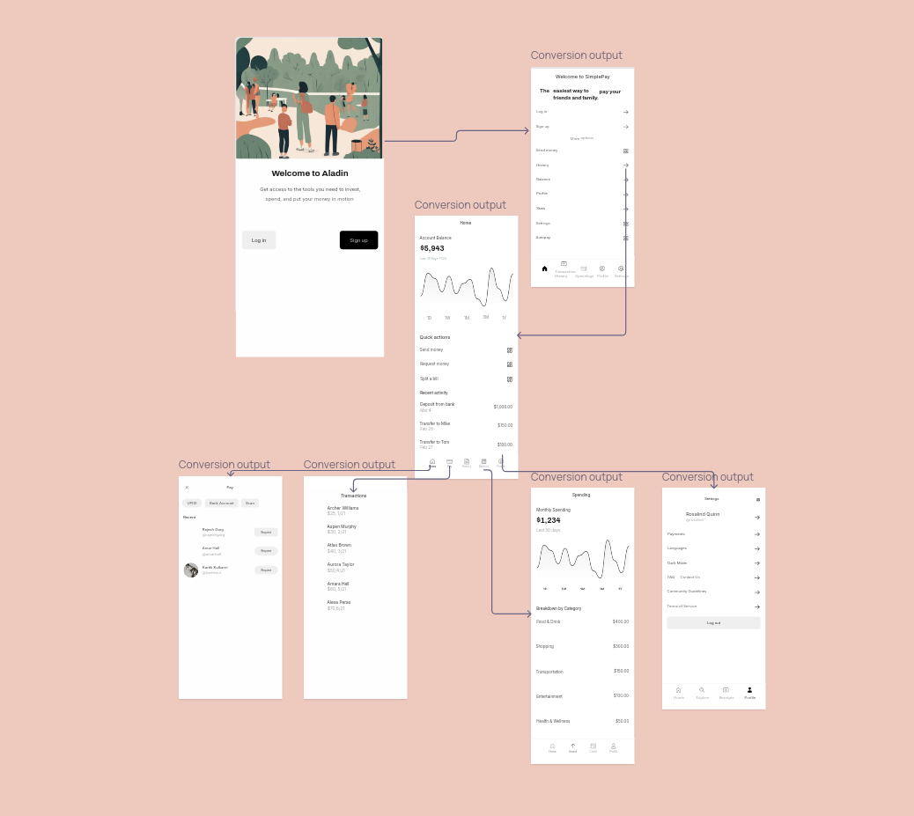
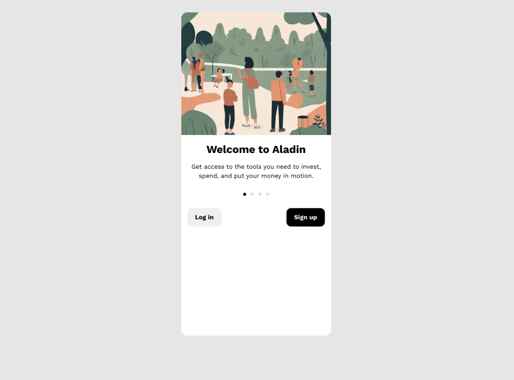
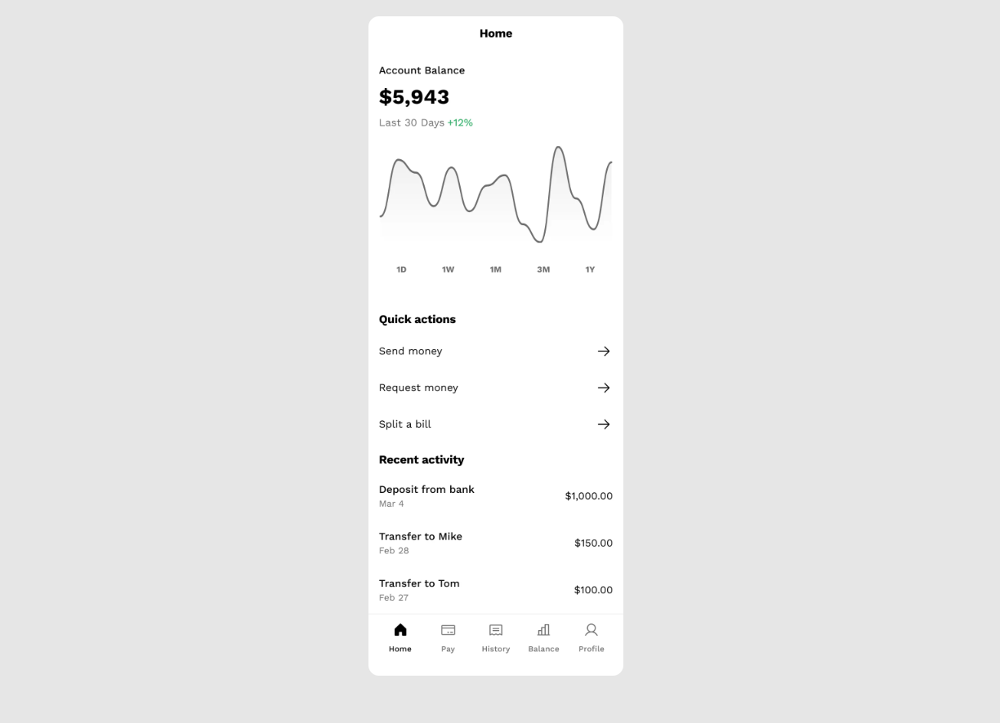
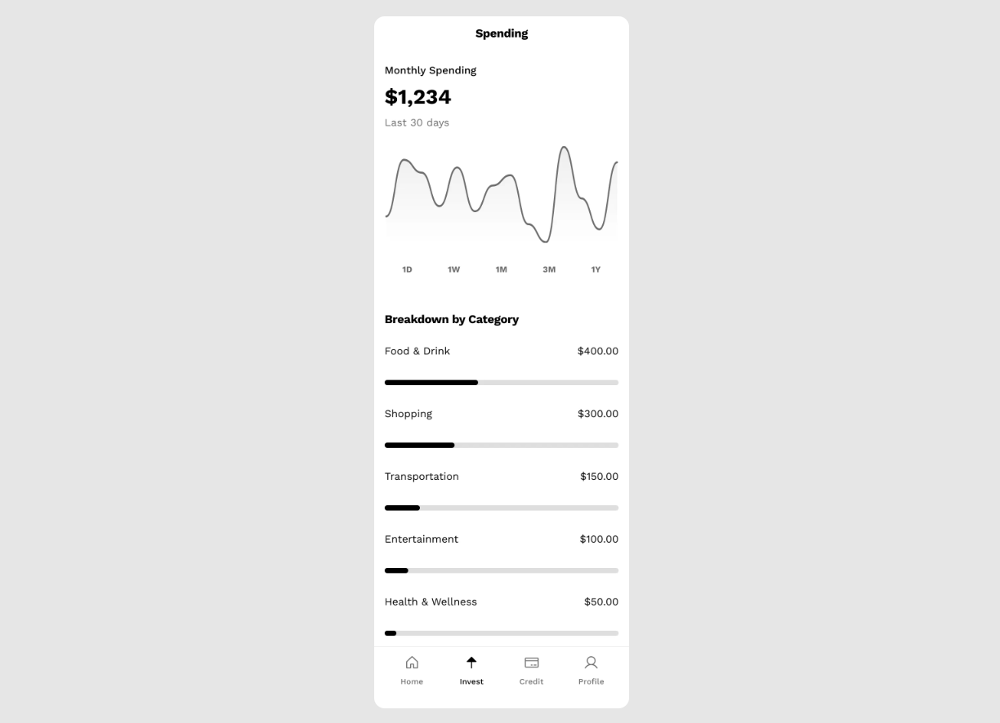
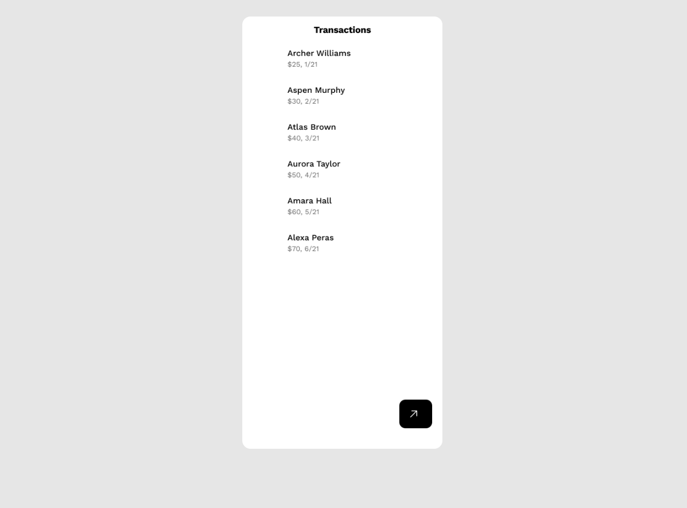
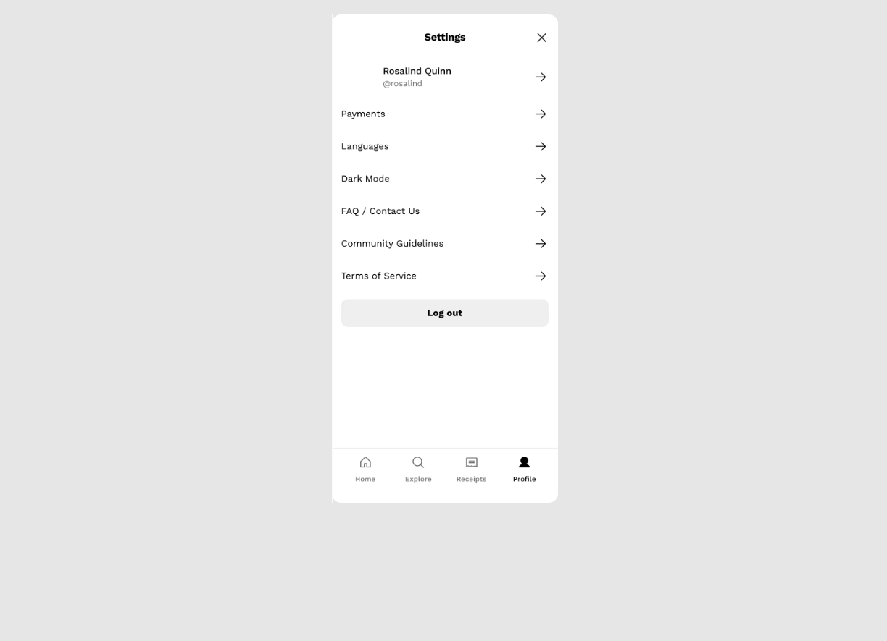

# GPay: Software Design Document

## Table of Contents
1. [Introduction](#1-introduction)  
   1.1 [Purpose](#11-purpose)  
   1.2 [Scope](#12-scope)  
   1.3 [Overview](#13-overview)  
   1.4 [Reference Material](#14-reference-material)  
   1.5 [Definitions and Acronyms](#15-definitions-and-acronyms)  
2. [System Overview](#2-system-overview)  
3. [System Architecture](#3-system-architecture)  
   3.1 [Architectural Design](#31-architectural-design)  
   3.2 [Decomposition Description](#32-decomposition-description)  
   3.3 [Design Rationale](#33-design-rationale)  
4. [Data Design](#4-data-design)  
   4.1 [Data Description](#41-data-description)  
   4.2 [Data Dictionary](#42-data-dictionary)  
5. [Component Design](#5-component-design)  
6. [Human Interface Design](#6-human-interface-design)  
   6.1 [Overview of Gpay User Interface](#61-overview-of-Gpay User-interface)  
   6.2 [Screen Images](#62-screen-images)  
   6.3 [Screen Objects and Actions](#63-screen-objects-and-actions)  
7. [Appendices](#7-appendices)  
8. [References](#8-references)  

---

## 1. Introduction

### 1.1 Purpose
This Software Design Document (SDD) describes the architecture and design of GPay, a payment application aimed at providing secure, fast, and Gpay User-friendly transaction capabilities. It is intended for developers, testers, and stakeholders involved in the software development lifecycle.

### 1.2 Scope
GPay enables Gpay Users to make digital payments, transfer money, and manage transactions securely. The application supports multiple payment methods (UPI, card payments, bank transfers) and provides a seamless Gpay User experience.

### 1.3 Overview
This document outlines the system's architecture, data design, components, and human interface. It also includes design rationales, data flow descriptions, and requirements traceability.

### 1.4 Reference Material
- IEEE Std 1016-2009: Software Design Descriptions  
- GPay System Requirements Specification (SRS)  

### 1.5 Definitions and Acronyms
- **UPI**: Unified Payments Interface  
- **API**: Application Programming Interface  
- **SRS**: Software Requirements Specification  
- **SDD**: Software Design Document  

---

## 2. System Overview
GPay is a mobile and web application that facilitates digital transactions, Gpay User authentication, and transaction history management. It integrates with banks and payment gateways to ensure secure and efficient payment processing.

---

## 3. System Architecture

### 3.1 Architectural Design


GPay uses a microservices-based architecture with the following subsystems:  
- **Authentication Service**: Manages Gpay User login and session management.  
- **Transaction Service**: Handles payments and transaction validations.  
- **Notification Service**: Sends payment alerts and transaction updates.  
- **Database**: Stores Gpay User, transaction, and system data securely.  

#### Diagram

### 3.2 Decomposition Description


Subsystems interact via APIs:  
- **Authentication** provides Gpay User tokens.  
- **Transaction** validates and processes payments using APIs like UPI.  
- **Notification** integrates with email/SMS services.  

### 3.3 Design Rationale


The microservices architecture ensures scalability and easier maintenance. It isolates concerns, enabling independent deployment and testing.

---

## 4. Data Design

### 4.1 Data Description
- **Gpay Users**: Stores Gpay User profiles, linked accounts, and preferences.  
- **Transactions**: Logs payment details, timestamps, and statuses.  
- **System Logs**: Captures audit logs for troubleshooting.  

### 4.2 Data Dictionary
| **Entity**       | **Type**        | **Description**                      |  
|-------------------|-----------------|--------------------------------------|  
| Gpay User_ID          | String          | Unique identifier for Gpay Users.         |  
| Transaction_ID   | String          | Unique identifier for transactions.  |  
| Amount           | Float           | Transaction amount.                  |  
| Timestamp        | DateTime        | Date and time of transaction.        |  

---

# GPay: Software Design Document

---

## 5. Component Design

Each subsystem (Authentication, Transaction, Notification) includes services and APIs. Below is an example pseudocode for the authentication subsystem:

```python
def login(Gpay Username, password):
    if validate_credentials(Gpay Username, password):
        return generate_token(Gpay Username)
    else:
        return "Invalid Credentials"
```
## 6. Human Interface Design

### 6.1 Overview of Gpay User Interface

The Gpay User interface allows Gpay Users to log in, initiate payments, view transaction history, and receive notifications. The design prioritizes simplicity and responsiveness to ensure a seamless Gpay User experience.

### 6.2 Initial Design 
- **Home Page:** Displays a list of recent transactions and available payment options.  
   

- **Home Page After Gpay User Logged In:** Shows profile options and Gpay User-specific features.  
   

- **Gpay User to Gpay User Transaction Page:** Lists all transactions between Gpay Users.  
   

- **Spending Page:** Provides an overview of Gpay User spending.  
   

- **Complete Transaction History:** Displays the full history of Gpay User transactions.  
   

- **Settings Page:** Allows Gpay Users to configure their preferences and account settings.  
   

These UI designs were created using Figma and Galileo Design tools.
### 6.3 Screen Objects and Actions
| **Screen Object**  | **Action**                  |  
|---------------------|----------------------------|  
| Login Button       | Initiates login process.    |  
| Pay Now Button     | Navigates to payment page.  |  
| Transaction List   | Displays recent transactions.|  
| Notification Icon  | Shows new notifications.    |  
| Settings Icon      | Opens settings menu.        |  
| Logout Button      | Logs the Gpay User out of the application. |  

---


## 7. Appendices

- Detailed Gpay User flow diagrams.  
- API specifications.  
- Database schema.  

## 8 . References
- SWEBOK: [Software Engineering Body of Knowledge](https://www.computer.org/education/bodies-of-knowledge/software-engineering/v4)
- SDD Template: [SDD Template](https://wildart.github.io/MISG5020/standards/SDD_Template.pdf)
- IEEE 1016: [IEEE Standard for Information Technology](https://standards.ieee.org/ieee/1016/4502/)
