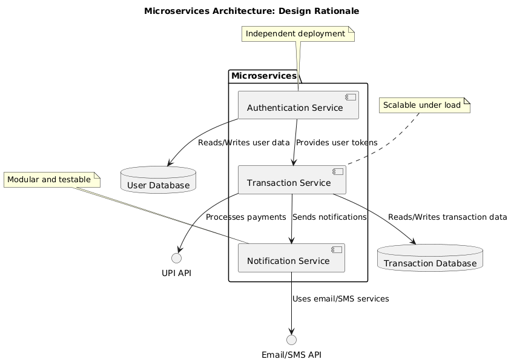

# GPay: Software Design Document

## Table of Contents
1. [Introduction](#1-introduction)  
   1.1 [Purpose](#11-purpose)  
   1.2 [Scope](#12-scope)  
   1.3 [Overview](#13-overview)  
   1.4 [Reference Material](#14-reference-material)  
   1.5 [Definitions and Acronyms](#15-definitions-and-acronyms)  
2. [System Overview](#2-system-overview)  
3. [System Architecture](#3-system-architecture)  
   3.1 [Architectural Design](#31-architectural-design)  
   3.2 [Decomposition Description](#32-decomposition-description)  
   3.3 [Design Rationale](#33-design-rationale)  
4. [Data Design](#4-data-design)  
   4.1 [Data Description](#41-data-description)  
   4.2 [Data Dictionary](#42-data-dictionary)  
5. [Component Design](#5-component-design)  
6. [Human Interface Design](#6-human-interface-design)  
   6.1 [Overview of User Interface](#61-overview-of-user-interface)  
   6.2 [Screen Images](#62-screen-images)  
   6.3 [Screen Objects and Actions](#63-screen-objects-and-actions)  
7. [Requirements Matrix](#7-requirements-matrix)  
8. [Appendices](#8-appendices)  

---

## 1. Introduction

### 1.1 Purpose
This Software Design Document (SDD) describes the architecture and design of GPay, a payment application aimed at providing secure, fast, and user-friendly transaction capabilities. It is intended for developers, testers, and stakeholders involved in the software development lifecycle.

### 1.2 Scope
GPay enables users to make digital payments, transfer money, and manage transactions securely. The application supports multiple payment methods (UPI, card payments, bank transfers) and provides a seamless user experience.

### 1.3 Overview
This document outlines the system's architecture, data design, components, and human interface. It also includes design rationales, data flow descriptions, and requirements traceability.

### 1.4 Reference Material
- IEEE Std 1016-2009: Software Design Descriptions  
- GPay System Requirements Specification (SRS)  

### 1.5 Definitions and Acronyms
- **UPI**: Unified Payments Interface  
- **API**: Application Programming Interface  
- **SRS**: Software Requirements Specification  
- **SDD**: Software Design Document  

---

## 2. System Overview
GPay is a mobile and web application that facilitates digital transactions, user authentication, and transaction history management. It integrates with banks and payment gateways to ensure secure and efficient payment processing.

---

## 3. System Architecture

### 3.1 Architectural Design


GPay uses a microservices-based architecture with the following subsystems:  
- **Authentication Service**: Manages user login and session management.  
- **Transaction Service**: Handles payments and transaction validations.  
- **Notification Service**: Sends payment alerts and transaction updates.  
- **Database**: Stores user, transaction, and system data securely.  

#### Diagram

### 3.2 Decomposition Description


Subsystems interact via APIs:  
- **Authentication** provides user tokens.  
- **Transaction** validates and processes payments using APIs like UPI.  
- **Notification** integrates with email/SMS services.  

### 3.3 Design Rationale


The microservices architecture ensures scalability and easier maintenance. It isolates concerns, enabling independent deployment and testing.

---

## 4. Data Design

### 4.1 Data Description
- **Users**: Stores user profiles, linked accounts, and preferences.  
- **Transactions**: Logs payment details, timestamps, and statuses.  
- **System Logs**: Captures audit logs for troubleshooting.  

### 4.2 Data Dictionary
| **Entity**       | **Type**        | **Description**                      |  
|-------------------|-----------------|--------------------------------------|  
| User_ID          | String          | Unique identifier for users.         |  
| Transaction_ID   | String          | Unique identifier for transactions.  |  
| Amount           | Float           | Transaction amount.                  |  
| Timestamp        | DateTime        | Date and time of transaction.        |  

---

# GPay: Software Design Document

---

## 5. Component Design

Each subsystem (Authentication, Transaction, Notification) includes services and APIs. Below is an example pseudocode for the authentication subsystem:

```python
def login(username, password):
    if validate_credentials(username, password):
        return generate_token(username)
    else:
        return "Invalid Credentials"
```

## 6. Human Interface Design

### 6.1 Overview of User Interface
Users can log in, initiate payments, view transaction history, and receive notifications. The design emphasizes simplicity and responsiveness.

### 6.2 Screen Images
- **Home Page:** Displays a list of transactions and payment options.  
   

- **Profile Page:** Displays all Profile options.  
   

- **User to User Transaction Page:** Displays all User to User Transactions.  
   

- **Money Management:**  
   

### 6.3 Screen Objects and Actions
| **Screen Object**  | **Action**                  |  
|---------------------|----------------------------|  
| Login Button       | Initiates login process.    |  
| Pay Now Button     | Navigates to payment page.  |  

---

## 7. Requirements Matrix

| **Requirement ID** | **Component**              |  
|---------------------|----------------------------|  
| R-01               | Authentication Service     |  
| R-02               | Transaction Service        |  

---

## 8. Appendices

- Detailed user flow diagrams.  
- API specifications.  
- Database schema.  

## 9 . References
- SWEBOK: [Software Engineering Body of Knowledge](https://www.computer.org/education/bodies-of-knowledge/software-engineering/v4)
- SDD Template: [SDD Template](https://wildart.github.io/MISG5020/standards/SDD_Template.pdf)
- IEEE 1016: [IEEE Standard for Information Technology](https://standards.ieee.org/ieee/1016/4502/)
