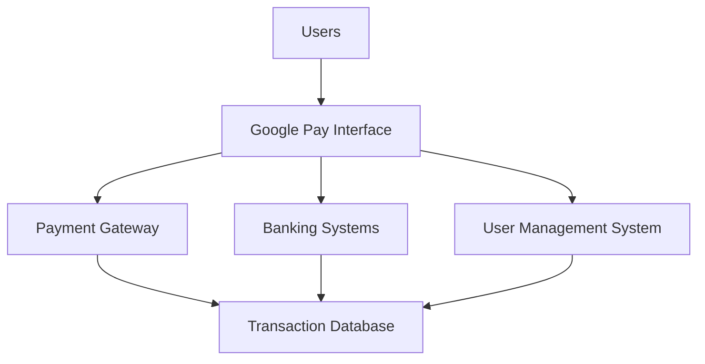
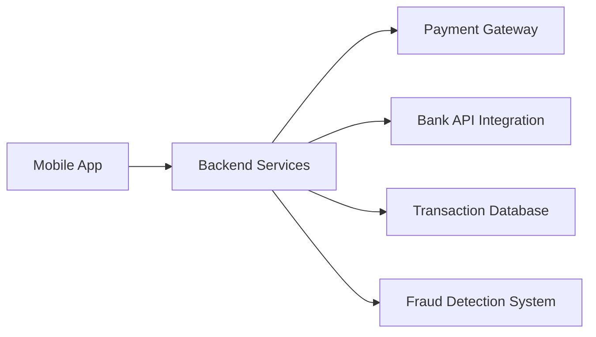
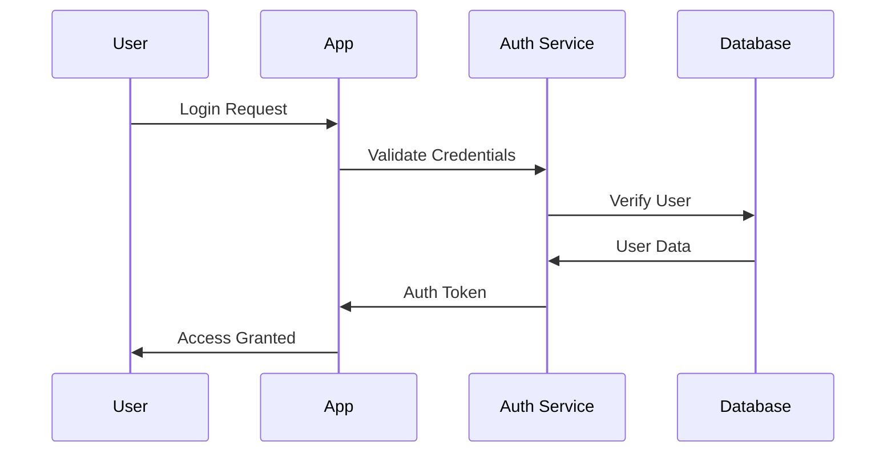
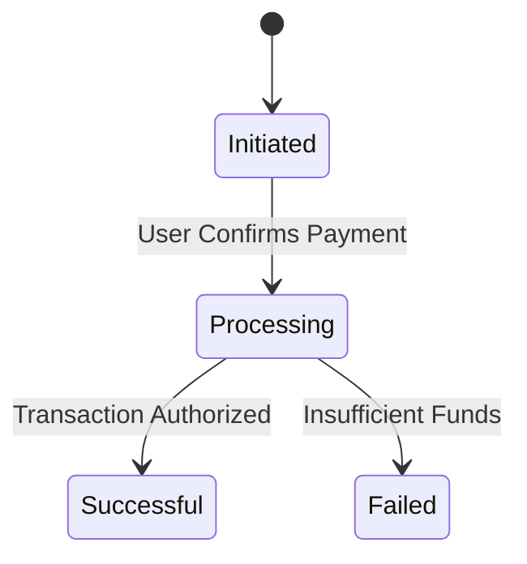
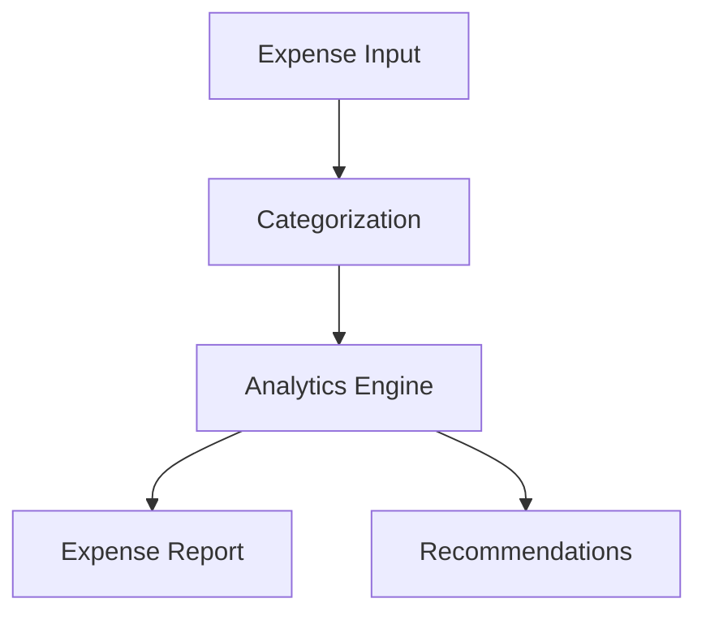

# Software Requirements Specification (SRS)
## Google Pay v1.0

## Table of Contents
1. [Introduction](#1-introduction)
2. [System Overview](#2-system-overview)
3. [Functional Requirements](#3-functional-requirements)
4. [Use Cases](#4-use-cases)
5. [Non-Functional Requirements](#5-non-functional-requirements)
6. [System Constraints](#6-system-constraints)
7. [Appendix](#7-appendix)

## 1. Introduction

### 1.1 Purpose
Google Pay is designed to provide users with a seamless and secure payment platform. It enables users to make online and offline payments, transfer money, and manage their finances. This document defines the requirements for building and maintaining the platform.

### 1.2 Project Scope
Google Pay serves as a versatile platform for:
- Instant money transfers
- Bill payments
- Mobile recharges
- Merchant payments
- Financial management tools

### 1.3 System Context

## 2. System Overview

### 2.1 Core Components

### 2.2 Key Features

1. **Payment Services**
   - Peer-to-peer transfers
   - Merchant payments via QR codes
   - NFC-based transactions

2. **Financial Management**
   - Expense tracking
   - Saving goals
   - Transaction history

3. **Security Features**
   - Multi-factor authentication
   - Fraud detection and prevention
   - Tokenization for secure card storage

4. **Customer Support**
   - 24/7 help desk
   - In-app chat support
   - Dispute resolution

## 3. Functional Requirements

### 3.1 User Authentication & Authorization

#### Detailed Requirements:
1. **Registration Process**
   - Phone number and email verification
   - Biometric authentication setup (optional)
   - Integration with Google Account

2. **Authentication Features**
   - OTP-based login
   - Biometric login (fingerprint/face recognition)
   - Session expiration after inactivity

### 3.2 Payment Process

#### Payment Requirements:
1. **Transaction Flow**
   - Initiation by user (peer-to-peer or merchant)
   - Secure tokenization of payment details
   - Authorization through PIN/biometrics

2. **Notifications**
   - Real-time notifications for successful/failed transactions
   - Monthly spending reports

### 3.3 Financial Tools

#### Requirements:
1. **Expense Categorization**
   - Automatic classification based on transaction metadata
   - User-defined categories

2. **Insights and Reports**
   - Monthly/annual spending trends
   - Personalized financial advice

## 4. Use Cases

### Use Case 1: Individual Users

| Use Case ID | UC-01 |
|-------------|-------|
| Name | Send Money |
| Actors | User, System |
| Description | A user sends money to another user using Google Pay. |
| Preconditions | Both users have Google Pay accounts. |
| Postconditions | Transaction is completed and both users receive notifications. |
| Main Flow | 1. User initiates a transfer.  2. System verifies payment details.  3. System processes payment.  4. Both users are notified. |
| Alternative Flows | A1: Insufficient balance.  A2: Invalid recipient details. |

### Use Case 2: Merchants

| Use Case ID | UC-02 |
|-------------|-------|
| Name | Receive Payments |
| Actors | Merchant, User, System |
| Description | A merchant receives a payment from a customer using a QR code. |
| Preconditions | Merchant is registered on Google Pay. |
| Postconditions | Payment is processed and confirmed for both parties. |
| Main Flow | 1. User scans merchant QR code.  2. User confirms payment.  3. System processes and notifies both parties. |
| Alternative Flows | A1: Payment fails.  A2: Network error. |

## 5. Non-Functional Requirements

### 5.1 Performance Requirements

| Metric | Normal Load | Peak Load |
|--------|-------------|-----------|
| Transaction Processing Time | < 2 seconds | < 5 seconds |
| Concurrent Users | 10,000 | 50,000 |
| API Response Time | < 300ms | < 1 second |

### 5.2 Security Requirements

1. **Data Protection**
   - Encryption for all sensitive data
   - Compliance with PCI DSS standards

2. **System Security**
   - Regular penetration testing
   - Fraud detection and prevention mechanisms

### 5.3 Reliability Requirements

1. **Availability**
   - 99.95% uptime
   - Automated failover systems

2. **Error Handling**
   - Comprehensive logging
   - User-friendly error messages

## 6. System Constraints

### 6.1 Technical Constraints
1. **Infrastructure**
   - Cloud-based hosting on Google Cloud Platform
   - Use of Kubernetes for container orchestration

2. **Development**
   - Frontend: Flutter
   - Backend: Node.js/Express
   - Database: Firebase Firestore

### 6.2 Business Constraints
1. **Timeline**
   - MVP: 6 months
   - Full release: 1 year

2. **Budget**
   - Initial development: $2M
   - Maintenance: $500K/year

## 7. Appendix

### 7.1 Terminology

| Term | Definition |
|------|------------|
| NFC | Near-Field Communication |
| OTP | One-Time Password |
| Tokenization | Process of substituting sensitive data with unique identifiers |

---

