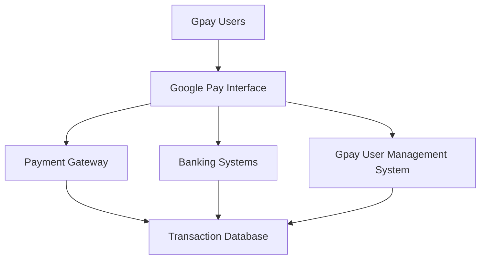
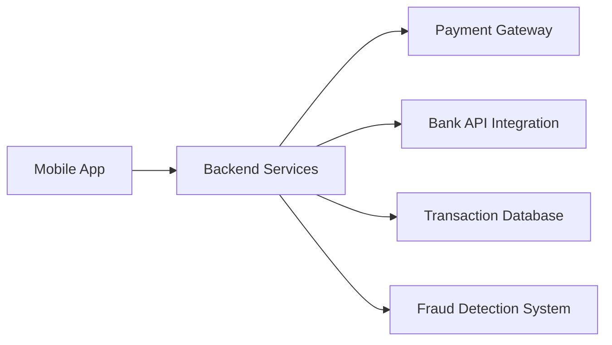
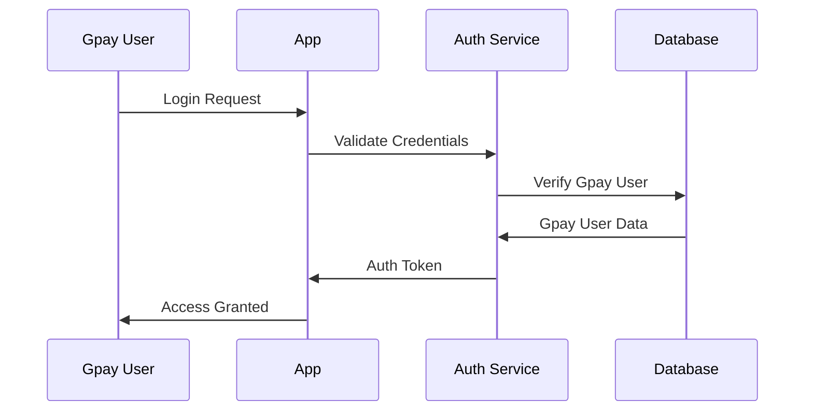
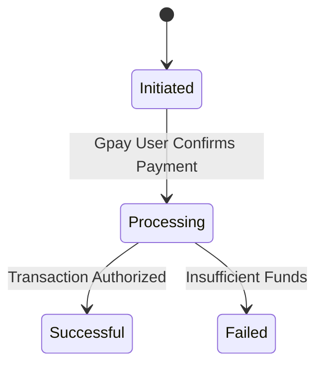
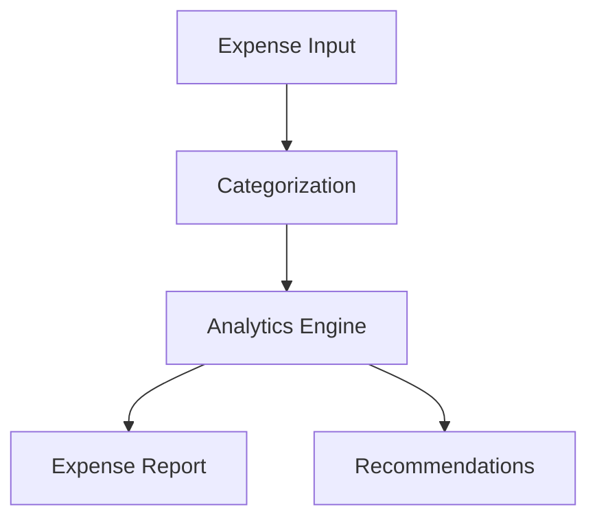
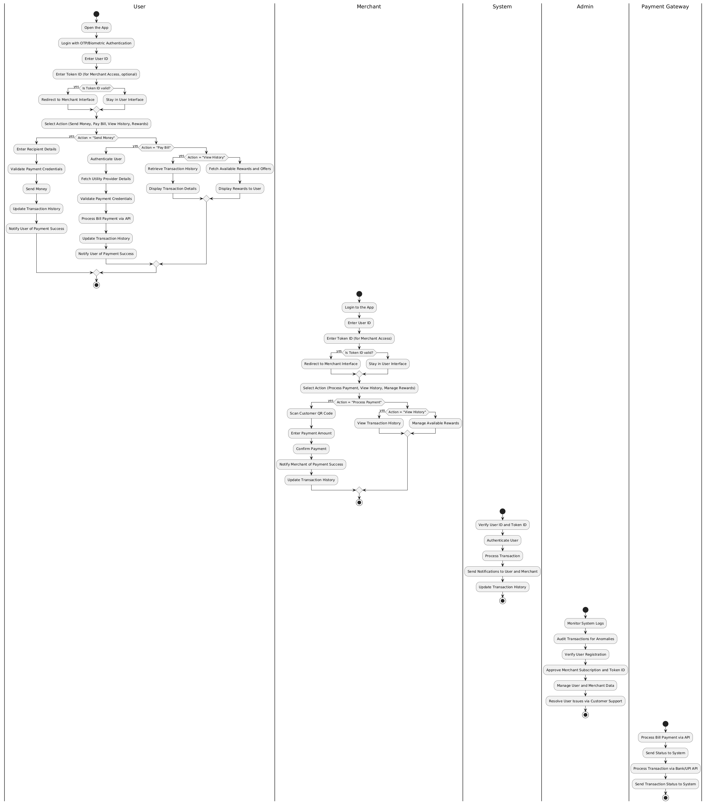

# Software Requirements Specification (SRS)
## Google Pay v1.0

## Table of Contents
1. [Introduction](#1-introduction)
2. [System Overview](#2-system-overview)
3. [Functional Requirements](#3-functional-requirements)
4. [Use Cases](#4-use-cases)
5. [Non-Functional Requirements](#5-non-functional-requirements)
6. [System Constraints](#6-system-constraints)
7. [Appendix](#7-appendix)

## 1. Introduction

### 1.1 Purpose
Google Pay is designed to provide users with a seamless and secure payment platform. It enables users to make online and offline payments, transfer money, and manage their finances. This document defines the requirements for building and maintaining the platform.

### 1.2 Project Scope
Google Pay serves as a versatile platform for:
- Instant money transfers
- Bill payments
- Mobile recharges
- Merchant payments
- Financial management tools

### 1.3 System Context

## 2. System Overview

### 2.1 Core Components

### 2.2 Key Features

1. **Payment Services**
   - Peer-to-peer transfers
   - Merchant payments via QR codes
   - NFC-based transactions

2. **Financial Management**
   - Expense tracking
   - Saving goals
   - Transaction history

3. **Security Features**
   - Multi-factor authentication
   - Fraud detection and prevention
   - Tokenization for secure card storage

4. **Customer Support**
   - 24/7 help desk
   - In-app chat support
   - Dispute resolution

## 3. Functional Requirements

### 3.1 Gpay User Authentication & Authorization

#### Detailed Requirements:
1. **Registration Process**
   - Phone number and email verification
   - Biometric authentication setup (optional)
   - Integration with Google Account

2. **Authentication Features**
   - OTP-based login
   - Biometric login (fingerprint/face recognition)
   - Session expiration after inactivity

### 3.2 Payment Process

#### Payment Requirements:
1. **Transaction Flow**
   - Initiation by Gpay User (peer-to-peer or merchant)
   - Secure tokenization of payment details
   - Authorization through PIN/biometrics

2. **Notifications**
   - Real-time notifications for successful/failed transactions
   - Monthly spending reports

### 3.3 Financial Tools

#### Requirements:
1. **Expense Categorization**
   - Automatic classification based on transaction metadata
   - Gpay User-defined categories

2. **Insights and Reports**
   - Monthly/annual spending trends
   - Personalized financial advice

## 4. Use Cases

## 4.1 **Gpay User Use Case: Send Money**
**Use Case ID**: UC-01  
**Actor**: Gpay User  
**Description**: A Gpay User sends money to another Gpay User or merchant.

- **Login**: Gpay User logs in with OTP/Biometric and enters Gpay User ID and optional Token ID.
- **Token ID Verification**: If Token ID is valid, Gpay User is redirected to Merchant Interface; otherwise, stays in Gpay User Interface.
- **Action Selection**: Gpay User selects "Send Money" and enters recipient details.
- **Payment Validation**: System validates recipient credentials and payment credentials.
- **Transaction Processing**: Gpay User confirms the payment, and the system processes it.
- **Transaction History**: The system updates the transaction history.
- **Notification**: The system notifies the Gpay User of payment success.

**Alternative Flows**:
- **A1 (Invalid Recipient Details)**: If the recipient details are invalid, the system prompts the Gpay User to re-enter them.
- **A2 (Insufficient Balance)**: If balance is insufficient, the system informs the Gpay User, and the transaction is not processed.

---

## 4.2 **Gpay User Use Case: Pay Bill**
**Use Case ID**: UC-02  
**Actor**: Gpay User  
**Description**: A Gpay User pays a utility bill via the app.

- **Login**: Gpay User logs in with OTP/Biometric and enters Token ID (if applicable).
- **Authentication**: System authenticates the Gpay User.
- **Action Selection**: Gpay User selects "Pay Bill" option.
- **Utility Provider Selection**: System fetches the list of available utility providers.
- **Payment Validation**: System validates payment credentials.
- **Bill Payment Processing**: System processes the bill payment via API.
- **Transaction History**: The system updates the transaction history.
- **Notification**: The system notifies the Gpay User of payment success.

**Alternative Flows**:
- **A1 (Unsupported Utility Provider)**: If the utility provider is unsupported, the system alerts the Gpay User and cancels the transaction.
- **A2 (Payment Failure)**: If payment fails, the system informs the Gpay User and prompts retry.

---

## 4.3 **Merchant Use Case: Process Payment**
**Use Case ID**: UC-03  
**Actor**: Merchant  
**Description**: A merchant processes a payment from a customer.

- **Login**: Merchant logs in with Gpay User ID and Token ID.
- **Token ID Verification**: If Token ID is valid, the system redirects to Merchant Interface; otherwise, stays in Gpay User Interface.
- **Action Selection**: Merchant selects "Process Payment" option.
- **QR Code Scanning**: Merchant scans customer QR code.
- **Enter Payment Details**: Merchant enters the payment amount.
- **Payment Confirmation**: Merchant confirms the payment.
- **Transaction Notification**: System notifies the merchant of payment success.
- **Transaction History**: System updates the transaction history for the merchant.

**Alternative Flows**:
- **A1 (Invalid QR Code)**: If the QR code is invalid, the system alerts the merchant to try again.
- **A2 (Payment Failure)**: If payment fails (due to insufficient funds or error), the system notifies the merchant, and the transaction is not processed.

---

## 4.4 **Admin Use Case: Manage Merchant Subscription**
**Use Case ID**: UC-04  
**Actor**: Admin  
**Description**: Admin manages merchant subscriptions and assigns Token IDs.

- **Login**: Admin logs into the system using administrative credentials.
- **Verify Merchant Application**: Admin verifies merchant applications for validity.
- **Approve Merchant Subscription**: Admin approves the merchant subscription after verification.
- **Assign Token ID**: Admin assigns a Token ID to the merchant for business access.
- **Manage Data**: Admin manages Gpay User and merchant data in the system.
- **Customer Support**: Admin resolves Gpay User issues via customer support channels.

**Alternative Flows**:
- **A1 (Incomplete Application)**: If merchant application is incomplete, admin requests additional details.
- **A2 (Subscription Denial)**: If subscription is denied, the admin informs the merchant.

---

## 4.5 **System Use Case: Process Transaction**
**Use Case ID**: UC-05  
**Actor**: System  
**Description**: The system processes the transaction, validates credentials, and updates histories.

- **Authentication**: System verifies Gpay User credentials (OTP/Biometric).
- **Payment Validation**: System validates payment details (recipient details, payment amount).
- **Transaction Processing**: System communicates with the payment gateway to process the transaction.
- **Send Notifications**: System sends payment success notifications to both Gpay User and merchant.
- **Update Transaction History**: System updates transaction history for both Gpay User and merchant.

---

## 4.6 **Payment Gateway Use Case: Process Transaction**
**Use Case ID**: UC-06  
**Actor**: Payment Gateway  
**Description**: The payment gateway processes a transaction via external APIs.

- **Receive Payment Request**: System sends payment request to the payment gateway.
- **Process Payment**: Payment gateway processes the payment via UPI or bank API.
- **Transaction Status**: Payment gateway sends transaction status (success/failure) back to the system.
- **Send Notification**: System notifies both Gpay User and merchant of the payment result.

---
### Diagram:

---
## 5. Non-Functional Requirements

### 5.1 Performance Requirements

| Metric | Normal Load | Peak Load |
|--------|-------------|-----------|
| Transaction Processing Time | < 2 seconds | < 5 seconds |
| Concurrent Gpay Users | 10,000 | 50,000 |
| API Response Time | < 300ms | < 1 second |

### 5.2 Security Requirements

1. **Data Protection**
   - Encryption for all sensitive data
   - Compliance with PCI DSS standards

2. **System Security**
   - Regular penetration testing
   - Fraud detection and prevention mechanisms

### 5.3 Reliability Requirements

1. **Availability**
   - 99.95% uptime
   - Automated failover systems

2. **Error Handling**
   - Comprehensive logging
   - Gpay User-friendly error messages

### 5.4 Usability Requirements

1. **Gpay User Interface Design**
   - Intuitive and easy-to-use mobile app interface.
   - Support for multiple languages and accessibility features.

2. **Gpay User Training**
   - In-app tutorials for new Gpay Users.
   - Context-sensitive help and tips.

3. **Support Channels**
   - 24/7 support with minimal wait times.
   - Multiple support channels: chat, email, and phone.

### 5.5 Scalability Requirements

1. **Vertical Scaling**
   - Dynamic resource allocation to handle traffic spikes.

2. **Horizontal Scaling**
   - Load balancing for distributed servers to support a growing Gpay User base.

3. **Data Scalability**
   - Efficient database sharding to manage large volumes of transactions and Gpay User data.

## 6. System Constraints

### 6.1 Technical Constraints
1. **Infrastructure**
   - Cloud-based hosting on Google Cloud Platform
   - Use of Kubernetes for container orchestration

2. **Development**
   - Frontend: Flutter
   - Backend: Node.js/Express
   - Database: Firebase Firestore

### 6.2 Business Constraints
1. **Timeline**
   - MVP: 6 months
   - Full release: 1 year

2. **Budget**
   - Initial development: $2M
   - Maintenance: $500K/year

## 7. Appendix

### 7.1 Terminology

| Term | Definition |
|------|------------|
| NFC | Near-Field Communication |
| OTP | One-Time Password |
| Tokenization | Process of substituting sensitive data with unique identifiers |

---
