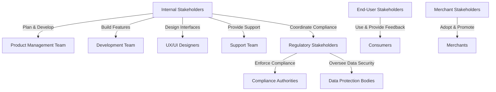
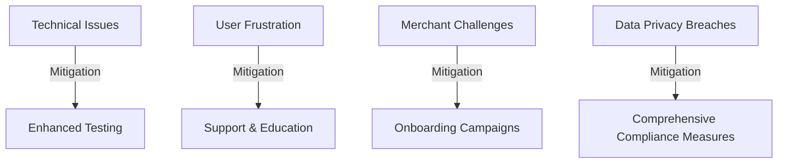

# Google Pay Stakeholder Management Strategy

---

## 1. Introduction  
This document outlines the key stakeholders involved in the Google Pay ecosystem, their roles, responsibilities, and the impact they have on the product's success. The goal is to ensure effective collaboration among all parties, fostering a seamless and secure digital payment experience for users and merchants.

---

## 2. Stakeholder Classification  
The stakeholders in the Google Pay ecosystem are categorized as follows:  

1. **Internal Stakeholders** – Teams responsible for Google Pay's development, support, and enhancement.  
2. **End-User Stakeholders** – Consumers using Google Pay for transactions.  
3. **Merchant Stakeholders** – Businesses and service providers accepting Google Pay as a payment method.  
4. **Regulatory Stakeholders** – Authorities ensuring compliance with financial and data protection standards.  

---

## 3. Stakeholder Profiles  

### 3.1 Internal Stakeholders  

| **Stakeholder**        | **Role**                   | **Responsibilities**                                | **Impact**                              | **Qualifications**                           |
|------------------------|----------------------------|----------------------------------------------------|------------------------------------------|-----------------------------------------------|
| Product Management Team| Strategic Leaders          | - Define the roadmap and feature sets.             | Guide Google Pay's growth and direction.| Expertise in product strategy and user research.|
| Development Team       | Technical Developers       | - Develop and maintain Google Pay's core features. | Ensure high performance and reliability. | Skilled in mobile and web app development.      |
| UX/UI Designers        | User Experience Designers  | - Create user-friendly interfaces and workflows.   | Enhance user satisfaction and adoption. | Proficient in design principles for mobile apps.|  
| Support Team           | Customer Support           | - Handle user and merchant queries and issues.     | Build trust and satisfaction among users.| Skilled in issue resolution and communication.  |

---

### Stakeholder Relationships

---

## 4. Engagement Strategy  

### 4.1 Communication Channels  

| **Channel Type**       | **Purpose**                                  | **Examples**                                     |
|------------------------|----------------------------------------------|-------------------------------------------------|
| **User Feedback**      | Collect consumer feedback                    | In-app surveys, reviews, and helpdesk tickets. |
| **Merchant Outreach**  | Educate and onboard merchants                | Tutorials, webinars, and live support.         |
| **Regulatory Updates** | Ensure adherence to laws and regulations     | Compliance audits, legal documentation reviews.|

---

## 5. Risk Management  

### Risk and Mitigation Diagram  

| **Risk Category**      | **Potential Impact**                         | **Mitigation Strategy**                         |
|------------------------|---------------------------------------------|------------------------------------------------|
| Technical Issues       | Interruptions to payment services           | Conduct regular testing and monitoring.       |
| User Frustration       | Reduced user satisfaction                   | Provide robust support and educational materials.|  
| Merchant Challenges    | Reluctance to adopt Google Pay              | Offer training and onboarding incentives.     |  
| Data Privacy Breaches  | Loss of trust and regulatory penalties      | Adhere strictly to data protection regulations.|  

---

## 6. Conclusion  

Effective stakeholder management is crucial for Google Pay's continued success. By maintaining robust communication, addressing risks proactively, and fostering collaboration, Google Pay aims to provide a secure, seamless, and trusted payment solution for users and merchants worldwide.

---

## Version Control  

- **Version:** 1.0  
- **Last Updated:** 11 December 2024  
- **Next Review:** 21 June 2025  
