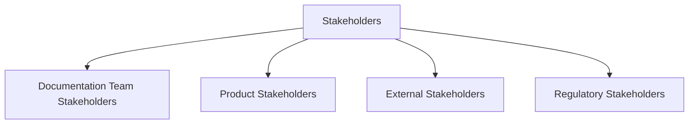
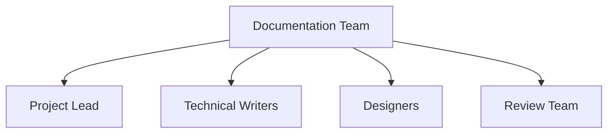
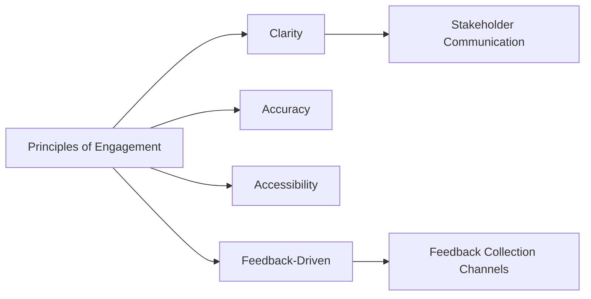
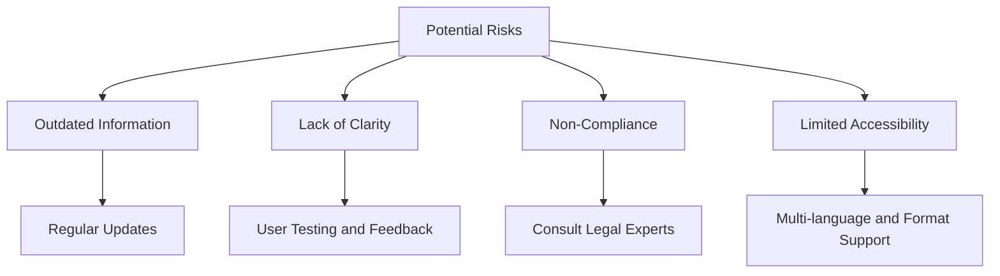

# Stakeholder Management Strategy

---

## 1. Introduction

This document outlines the key stakeholders involved in the creation and distribution of the **Google Pay Documentation** project. 
It highlights their roles, responsibilities, and the impact of their contributions, ensuring a comprehensive resource about Google Pay's features, usage, and benefits.

---

## 2. Stakeholder Classification

Stakeholders are grouped into the following categories:

1. **Documentation Team Stakeholders** – Individuals directly involved in authoring, designing, and publishing the documentation.  
2. **Product Stakeholders** – Developers and businesses utilizing Google Pay-related materials.  
3. **External Stakeholders** – Partners, platforms, and organizations influencing or leveraging Google Pay information.  
4. **Regulatory Stakeholders** – Authorities ensuring compliance with payment system standards.  

---

## 3. Stakeholder Profiles

### 3.1 Documentation Team Stakeholders  

| **Stakeholder**          | **Role**                     | **Responsibilities**                              | **Impact**                              | **Qualifications**                               |
|--------------------------|------------------------------|--------------------------------------------------|------------------------------------------|-------------------------------------------------|
| Project Lead             | Documentation Strategist     | - Define goals and scope of the documentation.    | Ensure comprehensive and high-quality output. | Expert in documentation frameworks and Google Pay systems. |
| Technical Writers        | Content Creators             | - Author integration guides and API references.   | Provide clear and precise instructions.  | Skilled in technical writing and API documentation. |
| Designers                | Visual Guide Developers      | - Create visuals, diagrams, and layouts.          | Enhance the usability and engagement of the documentation. | Proficient in design tools and technical illustration. |
| Review Team              | Quality and Compliance Auditors | - Review content for accuracy, clarity, and compliance. | Ensure high standards and error-free documentation. | Experts in technical editing and payment system regulations. |
| Localization Specialists | Translators and Cultural Experts | - Translate documentation into multiple languages. | Broaden accessibility across different regions. | Fluent in multiple languages with technical translation expertise. |
| Technical SMEs           | Subject Matter Experts       | - Provide insights into complex technical concepts. | Enhance technical accuracy and depth of content. | Specialists in Google Pay architecture and APIs. |

---

### 3.2 Product Stakeholders  

| **Stakeholder**         | **Role**                       | **Responsibilities**                                | **Impact**                              | **Qualifications**                               |
|-------------------------|---------------------------------|----------------------------------------------------|------------------------------------------|-------------------------------------------------|
| Application Developers  | Documentation Users            | - Use documentation for integrating Google Pay.    | Drive the effectiveness of the integration process. | Proficient in backend development and API usage. |
| Business Owners         | Decision Makers                | - Leverage Google Pay for customer transactions.   | Expand payment options and business growth. | Knowledgeable in e-commerce or app-based services. |
| QA Engineers            | Integration Testers            | - Validate the integration process with test cases. | Identify and report potential bugs or inconsistencies. | Skilled in testing frameworks and payment systems. |
| Marketing Teams         | Adoption Drivers               | - Promote the benefits of Google Pay integration.  | Drive developer engagement and usage.    | Experts in digital marketing strategies and technical communication. |

---

<!-- ### 3.3 External Stakeholders  

| **Stakeholder**         | **Role**                       | **Responsibilities**                                | **Impact**                              | **Qualifications**                               |
|-------------------------|---------------------------------|----------------------------------------------------|------------------------------------------|-------------------------------------------------|
| Google Pay API Team     | Technology Providers           | - Provide API specifications and updates.          | Ensure compatibility and feature richness. | Experts in API design and Google Pay architecture. |
| Integration Partners    | Technical Support Providers    | - Offer third-party tools and support services.    | Facilitate developers with advanced tools.  | Vendors with experience in payment processing. |
| User Accounts           | End Users                      | - Create accounts for using Google Pay services.   | Enable authentication and user-specific features. | Individuals with basic technical know-how. |
| Login Systems           | Authentication Providers       | - Securely handle login and session management.    | Ensure user security and privacy during interactions. | Expertise in secure authentication protocols. |
| Payment Gateways        | Transaction Processors         | - Facilitate the processing of payments.           | Ensure smooth and secure transactions.   | Experts in payment gateway implementation and security. |
| Partner Organizations   | Collaborative Innovators       | - Work with Google to expand integration use cases. | Enhance features and adoption through partnerships. | Experienced in fintech and technical collaboration. |

--- -->
### 3.3 External Stakeholders  

| **Stakeholder**         | **Purpose**                                                    | **Login Method**                                              | **Examples**                                             |
|-------------------------|--------------------------------------------------------------|-------------------------------------------------------------|---------------------------------------------------------|
| GPay Users (End Users)  | To access their Google Pay accounts for making payments, viewing transaction history, and managing linked bank accounts or cards. | Through their Google account or linked credentials.         | - Individuals using Google Pay for personal payments.    - Customers making purchases in stores or online. |
| Merchants (Business Owners) | To manage transactions, track customer payments, and reconcile accounts. | Through a merchant account tied to their Google Pay Merchant Center. | - Store owners using Google Pay for receiving payments.   - E-commerce businesses using Google Pay integration. |
| Support and Technical Teams | To provide customer support, resolve issues, or assist with merchant and user onboarding. | Through dedicated Google accounts with appropriate permissions. | - Payment gateway technical support teams.   - Customer service representatives assisting users and businesses. |
| Banks (Financial Institutions and Payment Service Providers) | To enable account linking, process transactions, and provide financial services. | Through secure institutional credentials or integrated systems. | - Partner banks offering Google Pay as a payment method.   - Payment service providers supporting backend processing. |

### 3.4 Regulatory Stakeholders  

| **Stakeholder**         | **Role**                       | **Responsibilities**                                | **Impact**                              | **Qualifications**                               |
|-------------------------|---------------------------------|----------------------------------------------------|------------------------------------------|-------------------------------------------------|
| Compliance Authorities  | Legal Advisors                 | - Ensure the documentation adheres to legal and regulatory standards (e.g., PCI DSS). | Safeguard user privacy and data security. | Legal and compliance experts in fintech. |
| Data Protection Agencies| Privacy Advocates              | - Monitor adherence to data privacy regulations.   | Maintain user trust and comply with laws. | Specialists in GDPR, CCPA, or equivalent regulations. |
| Standardization Bodies  | Industry Regulators            | - Define standards for payment integrations.       | Ensure interoperability and quality.     | Experts in ISO standards for fintech and APIs. |

---

## 4. Engagement Strategy

### 4.1 Principles of Engagement

1. **Clarity:** Ensure all stakeholders have a clear understanding of Google Pay's purpose and features.  
2. **Accuracy:** Maintain high standards of factual correctness and technical reliability.  
3. **Accessibility:** Ensure the documentation is easily accessible and understandable.  
4. **Feedback-Driven:** Incorporate feedback from users to improve the content.  

### 4.2 Communication Channels

| **Channel Type**         | **Purpose**                                  | **Examples**                                     |
|--------------------------|----------------------------------------------|-------------------------------------------------|
| **Formal Documentation** | Author and distribute materials              | Official documentation portals, user manuals.   |
| **Developer Forums**     | Foster collaboration and query resolution    | Google Developer Communities, Stack Overflow.   |
| **Support Channels**     | Address feature-related issues               | Email support, dedicated help desks.            |
| **Social Media Platforms** | Increase awareness and adoption             | LinkedIn, Twitter, and GitHub for updates.      |

---

## 5. Risk and Mitigation

| **Risk Category**        | **Potential Impact**                         | **Mitigation Strategy**                         |
|--------------------------|---------------------------------------------|------------------------------------------------|
| Outdated Information     | Confusion and feature underutilization      | Regularly update the documentation with feature changes. |
| Lack of Clarity          | Misunderstanding during usage               | Perform user testing and gather feedback to improve clarity. |
| Non-Compliance           | Legal and reputational damage              | Consult with legal and compliance experts during development. |
| Limited Accessibility    | Reduced reach to intended users             | Publish documentation in multiple languages and formats. |

---

## 6. Conclusion

The **Google Pay Documentation** project aims to provide users with a robust and clear guide for understanding and leveraging Google Pay. By involving key stakeholders and addressing potential risks, this strategy ensures the creation of high-quality resources.

---

## 7. Visualizations

### 7.1 Stakeholder Classification Diagram

### 7.2 Documentation Team Stakeholders Hierarchy

### 7.3 Engagement Strategy Workflow

### 7.4 Risk Mitigation Flow

