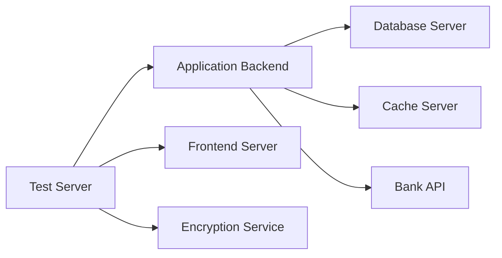
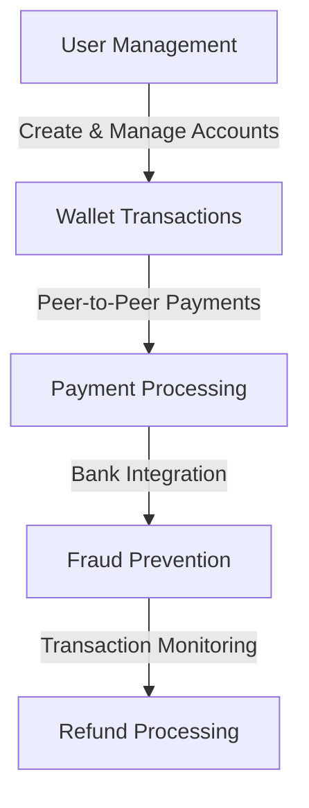
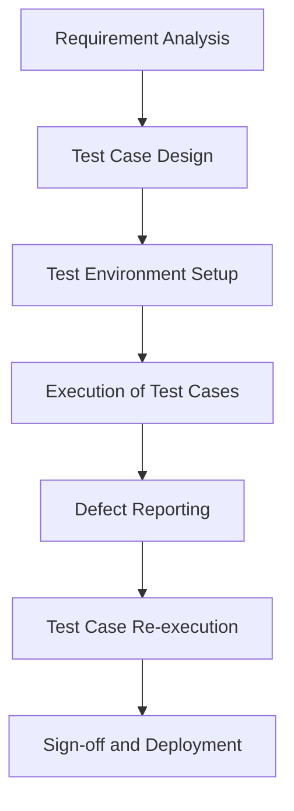
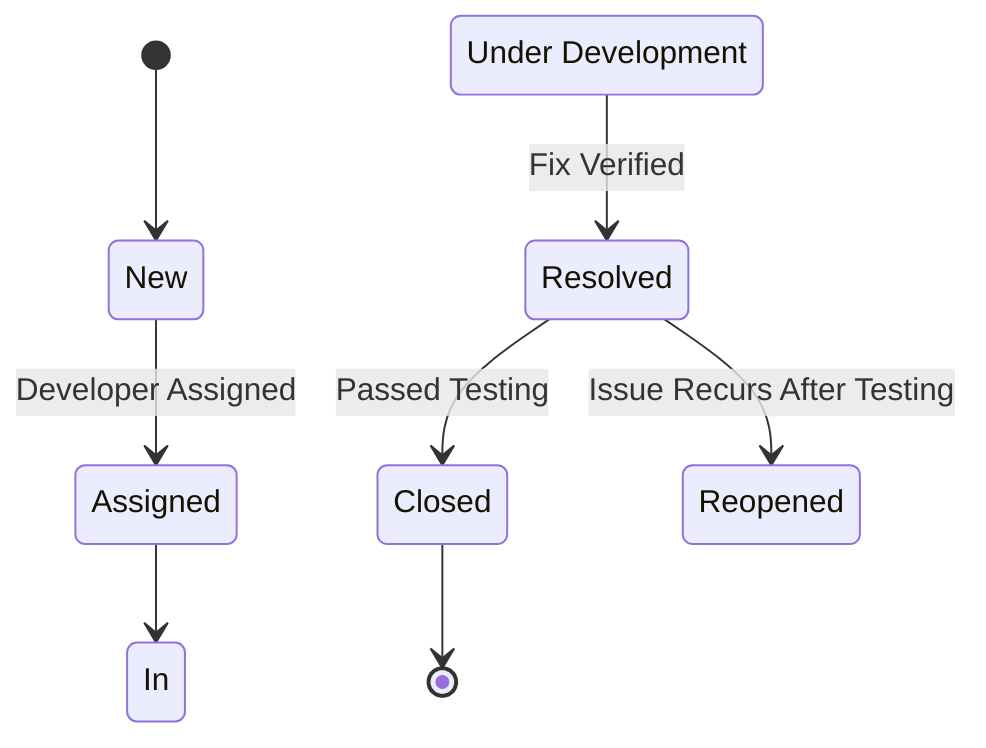

# Software Test Documentation
## Google Pay System
**Ensuring a Secure and Scalable Payment Platform through Comprehensive Testing**  

## Table of Contents
| Section | Title |
| ------- | ----- |
| 1 | Test Plan |
| 2 | Test Design Specification |
| 3 | Test Case Specification |
| 4 | Test Procedure Specification |
| 5 | Test Scenarios |
| 6 | Test Summary Report |

---

## **1. Test Plan**  

### **1.1 Introduction**  
The purpose of this document is to outline the testing strategy, methodology, and test cases for the **Google Pay System**, ensuring robust quality standards. This document follows the IEEE-829-2008 standard and uses a Behavior-Driven Development (BDD) approach.

---

### **1.2 Test Items**  
- User Management  
- Payment Transactions  
- Security and Fraud Prevention  
- Wallet and Bank Integration  

---

### **1.3 Features to be Tested**  
- **User Management System**: Registration, login, and profile features.  
- **Payment Transactions**: Peer-to-peer payments, bill payments, and refunds.  
- **Security**: OTP verification, encryption, and fraud detection.  
- **Integration**: Wallet management and bank linkage.  

---

### **1.4 Features Not to Be Tested**  
- NFC-based offline transactions.  
- Integration with cryptocurrency wallets (deferred to future phases).  

---

### **1.5 Testing Approach**  
The testing process includes:  
1. **Unit Testing**: Validating individual modules.  
2. **Integration Testing**: Ensuring proper interactions between components.  
3. **System Testing**: Testing the end-to-end functionality.  
4. **Acceptance Testing**: Validating against user requirements.  
5. **Performance Testing**: Ensuring scalability and responsiveness under load.  

**Testing Style**: Behavior-Driven Development (BDD) using **Cucumber** for Gherkin-style test scenarios and **Chai** for assertions.  

---

### **1.6 Pass/Fail Criteria**  
A test case is marked as **Pass** if actual outcomes match expected results. A test case is marked as **Fail** if there are deviations, performance issues, or errors.

---

### **1.7 Suspension and Resumption Criteria**  
- Testing will be **suspended** in the event of critical failures (e.g., server crashes, significant defects).  
- Testing will **resume** after defect resolution and retesting of the impacted areas. 

### **1.8 Test Environment**

| Component             | Details                              |  
|-----------------------|--------------------------------------|  
| **Client Systems**    | Chrome (v114+), Firefox (v98+), Edge |  
| **Server Environment**| GCP (Compute Engine, BigQuery, Firebase) |  
| **Databases**         | MySQL (v8+)                         |  
| **Encryption**        | AES-256 for transaction encryption   |  
| **Testing Tools**     | Selenium, Postman, JMeter           |  

Environment Configuration



- Database : Preloaded with test data for user accounts, transactions, and linked banks.
- Payment Gateway : Mock setup to simulate transactions without real-world implications.

---

## **2. Test Design Specification**  

### **2.1 Test Design Overview** 
This design ensures compliance with functional, performance, and security requirements, targeting critical modules such as peer-to-peer payments and fraud prevention.  

---

### **2.2 Test Features Overview**  
- **User Management**: Secure registration, login, and profile management.  
- **Payments**: Real-time peer-to-peer transactions, bill payments, and refunds.  
- **Security**: Fraud detection, OTP validation, and encryption.  
- **Integration**: Wallet top-ups and seamless bank linking.  



---

## 3. Test Case Specification

### 3.1 User Registration
```gherkin
Feature: User Registration

  Scenario: Successful user registration
    Given a new user is on the registration page
    When the user enters valid registration details
    And the user submits the registration form
    Then the user account should be created
    And a verification email should be sent
```

```javascript
const chai = require('chai');
const expect = chai.expect;

describe('User Registration', () => {
  it('should create a user account and send a verification email', () => {
    const registrationDetails = {
      email: 'user@example.com',
      phone: '1234567890',
      password: 'SecurePass123!'
    };
    const result = registerUser(registrationDetails);
    expect(result).to.have.property('success', true);
    expect(result).to.have.property('verificationEmailSent', true);
  });
});
```

### 3.2 Peer-to-Peer Payment
```gherkin
Feature: Peer-to-Peer Payment

  Scenario: Successful peer-to-peer transaction
    Given a registered user has sufficient wallet balance
    When the user initiates a transaction to another user
    Then the transaction should be processed successfully
    And the recipient's wallet should be updated
```

```javascript
describe('Peer-to-Peer Payment', () => {
  it('should process the transaction and update wallets', () => {
    const transactionDetails = {
      senderId: 'user123',
      recipientId: 'user456',
      amount: 50
    };
    const result = processPeerPayment(transactionDetails);
    expect(result).to.have.property('processed', true);
    expect(result.senderBalance).to.be.a('number');
    expect(result.recipientBalance).to.be.a('number');
  });
});
```

### 3.3 Fraud Prevention
```gherkin
Feature: Fraud Prevention

  Scenario: Detect and block fraudulent transactions
    Given a user attempts a suspicious transaction
    When the system detects unusual patterns
    Then the transaction should be blocked
    And an alert should be raised
```

```javascript
describe('Fraud Prevention', () => {
  it('should block suspicious transactions and raise alerts', () => {
    const transactionDetails = {
      userId: 'user123',
      amount: 10000,
      location: 'Unknown'
    };
    const result = detectFraud(transactionDetails);
    expect(result).to.have.property('blocked', true);
    expect(result).to.have.property('alertRaised', true);
  });
});
```

---

## 4. Test Procedure Specification

### 4.1 User Registration Procedure
1. Navigate to the registration page.
2. Enter valid registration details.
3. Submit the registration form.
4. Verify the user account creation and email verification.

### 4.2 Peer-to-Peer Payment Procedure
1. Ensure sufficient wallet balance.
2. Initiate a transaction to another registered user.
3. Verify transaction processing and wallet updates.

### 4.3 Fraud Prevention Procedure
1. Attempt a suspicious transaction.
2. Verify if the transaction is blocked.
3. Check for alert generation and logging.

---

## 5. Test Scenarios

| Scenario                    | Test Case                          | Expected Outcome                        |  
|-----------------------------|-------------------------------------|----------------------------------------|  
| User Load Testing           | 500 simultaneous users logging in  | Latency < 200ms, No server crashes     |  
| Payment Load Testing        | 1,000 transactions per minute      | Transactions processed < 2 seconds     |  

### 5.1 Functional Testing

| Module                  | Test Case                                                   | Expected Outcome                                                   |
|-------------------------|-------------------------------------------------------------|--------------------------------------------------------------------|
| User Management System  | Register with valid and invalid credentials.                | Successful registration or appropriate error messages.             |
|                         | Authenticate using Google account.                          | Successful login via OAuth.                                        |
|                         | Update profile details.                                     | Profile updates saved successfully.                                |
| Payment System          | Peer-to-peer payments.                                      | Transactions processed accurately.                                 |
|                         | Wallet top-ups using linked bank accounts.                  | Wallet updated correctly.                                          |
|                         | Refund processing for canceled transactions.                | Refunds issued within SLA.                                         |
| Fraud Detection         | Detect unusual transaction patterns.                        | Suspicious transactions blocked.                                   |

### 5.2 Performance Testing

| Scenario                    | Test Case                                         | Expected Outcome                                                   |
|-----------------------------|---------------------------------------------------|--------------------------------------------------------------------|
| User Load Testing           | 500 simultaneous users logging in and browsing.  | Stable performance with minimal latency.                           |
| Payment Load Testing        | 1,000 transactions per minute.                   | Transactions processed < 2 seconds.                                |
| Fraud Detection Stress Test | 10,000 transactions in an hour.                  | Real-time alerts and fraud prevention triggered.                   |

---

## 6. Test Summary Report

### 6.1 Test Summary
This section summarizes the testing activities, including the number of test cases executed, passed, and failed.

### Testing Workflow



### 6.2 Defect Summary
This section provides a summary of the defects identified during testing, including severity and status.

### Defect Lifecycle



## Conclusion

This test plan ensures comprehensive validation of the Google Pay System. By rigorously testing all functional, performance, and security aspects, we aim to deliver a robust, secure, and user-friendly payment platform.

---

## References
- IEEE-829-2008: [IEEE Standard for Software and System Test Documentation](https://standards.ieee.org/ieee/829/3787/)
- Cucumber: [Better Gherkin](https://cucumber.io/docs/bdd/better-gherkin/)
- Chai Assertion Library: [Chai.js](https://www.chaijs.com/)

---
