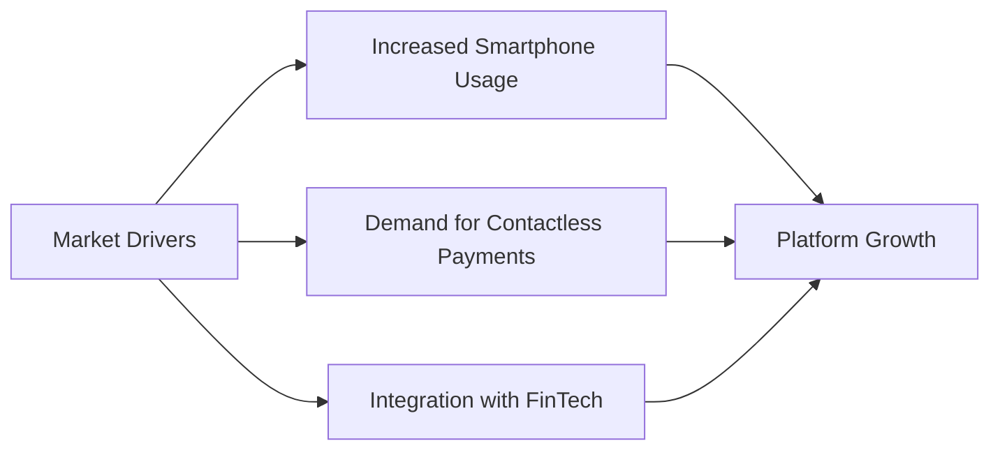
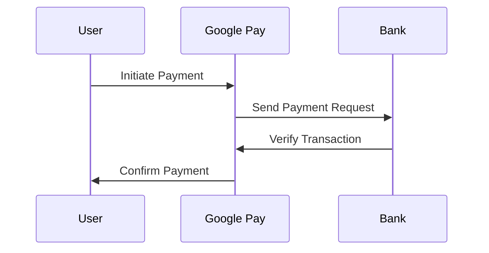
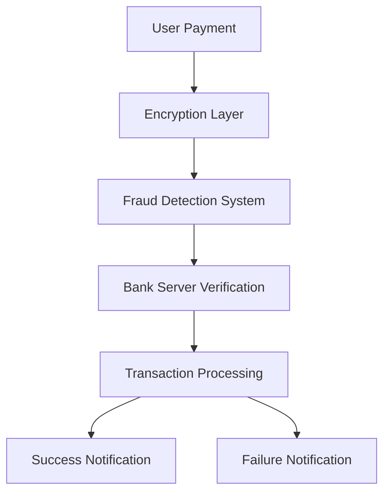
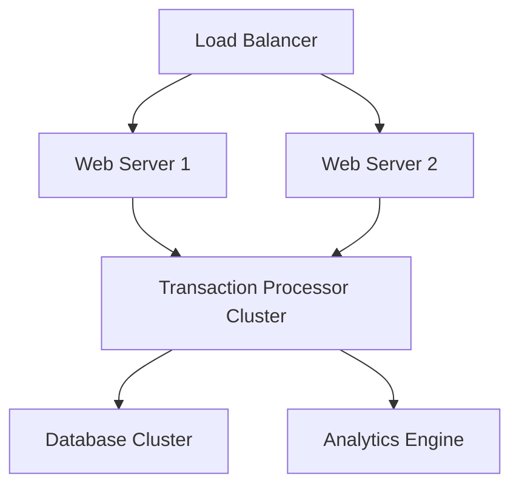
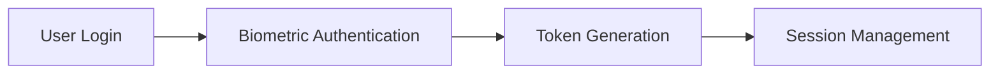
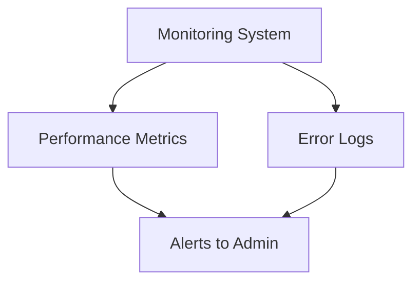
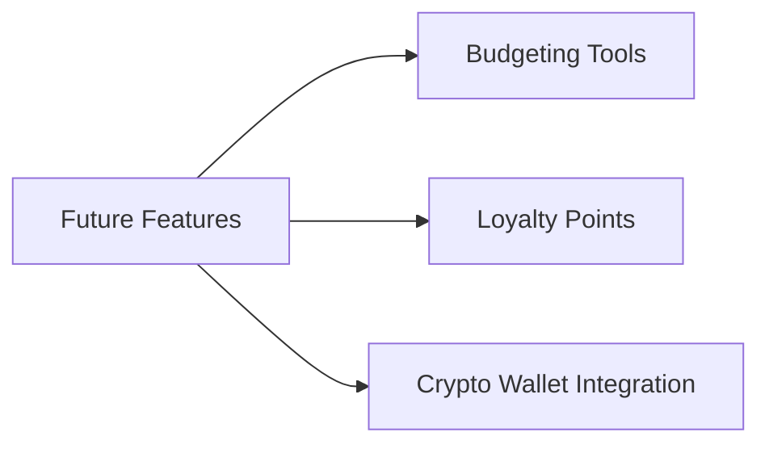

# User Requirements Document (URD)
## Google Pay: A Modern Digital Payment Solution
### Version 1.0 | December 2024

 

---

## Executive Summary

Google Pay revolutionizes digital payments by providing a secure, user-friendly, and seamless payment platform. Designed for individuals, businesses, and developers, Google Pay enables:

- **Secure transactions** with advanced encryption.
- **Contactless payments** through NFC technology.
- **Integration** with multiple banks, merchants, and financial tools.

---

## 1. Introduction

### 1.1 Purpose and Scope

The purpose of this document is to define the requirements for Google Pay's development, operation, and maintenance.

**Key Objectives:**
- Ensure secure and efficient payment processing.
- Provide a robust ecosystem for merchants and developers.
- Deliver an intuitive interface for users.

**Scope:**
- Individual payments and merchant transactions.
- Integration with financial institutions.
- Advanced analytics for users and merchants.

### 1.2 Market Context

The digital payment ecosystem is evolving:



---

## 2. User Personas

### 2.1 Primary Users

#### 2.1.1 Individual User - "Emily"
- **Background**: A tech-savvy young professional.
- **Goals**: 
  - Simplify day-to-day payments.
  - Manage multiple bank accounts in one app.
- **Pain Points**: 
  - Security concerns.
  - Payment failures during poor network connectivity.

#### 2.1.2 Merchant - "Rajesh"
- **Background**: Small business owner.
- **Goals**: 
  - Accept seamless payments.
  - Get detailed sales analytics.
- **Pain Points**: 
  - Lack of easy reconciliation tools.

### 2.2 Secondary Users

#### 2.2.1 Developer - "Anita"
- **Background**: App developer for FinTech solutions.
- **Goals**:
  - Integrate Google Pay APIs into apps.
  - Access sandbox environments for testing.

---

## 3. Detailed Requirements

### 3.1 Core Payment System 🔴

#### 3.1.1 Payment Workflow



### 3.2 Transaction Security 🔴

#### 3.2.1 Security Architecture



---

## 4. User Interface Requirements 🟡

### 4.1 Home Screen Layout

The home screen layout must display:

```
┌─────────────────────────────┐
│      Google Pay Wallet      │
├─────────────────────────────┤
│ Recent Transactions         │
│ ┌───────────────┐           │
│ │ Vendor Name    │ Amount    │
│ └───────────────┘           │
├─────────────────────────────┤
│ Add Money   | Transfer Money │
└─────────────────────────────┘
```

---

## 5. System Performance Requirements 🔴

### 5.1 Scalability Architecture



---

## 6. Security Requirements 🔴

### 6.1 Authentication System



---

## 7. Maintenance and Support 🟢

### 7.1 Monitoring and Alerts



---

## 8. Integration Requirements 🟢

### 8.1 Supported Integrations

1. **Bank APIs**
   - Real-time balance and transaction updates.
2. **Merchant Systems**
   - POS integrations.
3. **Third-Party Apps**
   - FinTech app support.

---

## 9. Future Considerations 🟢

### 9.1 Planned Features



---

## Document Control

| Version | Date | Author | Changes |
|---------|------|--------|---------|
| 1.0     | 2024-12-08 | Google Pay Team | Initial Draft |

---
