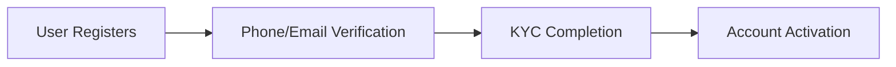
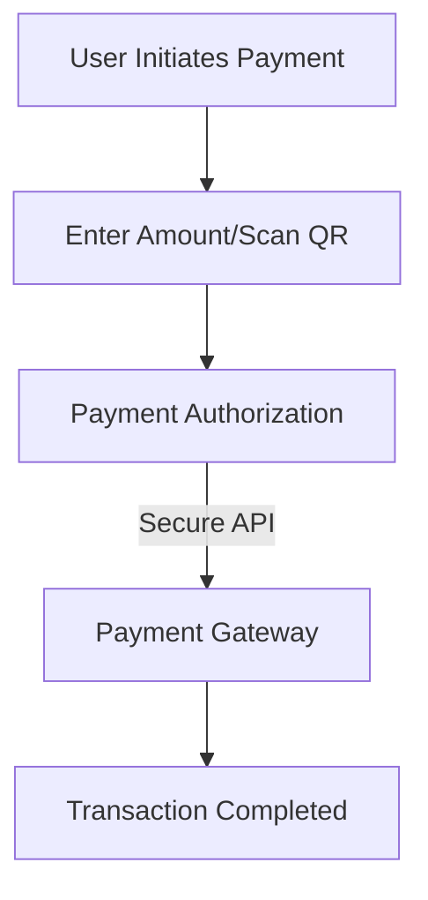
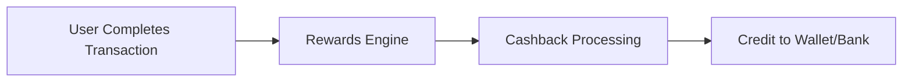
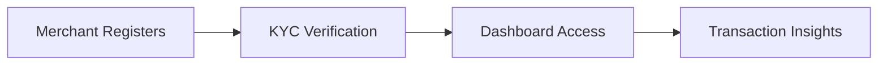
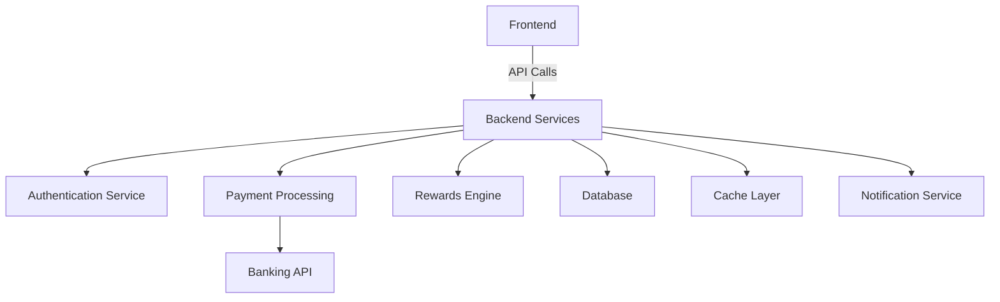
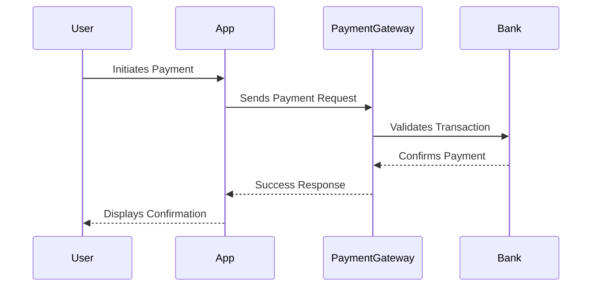

# Google Pay : Digital Payment Revolution 💳📲

## Table of Contents
- [Introduction](#introduction)
- [Vision Statement](#vision-statement)
- [Core Features](#core-features)
- [Project Boundaries](#project-boundaries)
- [Technical Architecture](#technical-architecture)
- [References & Inspiration](#references--inspiration)

## Introduction

Google Pay is a leader in the digital payment ecosystem, simplifying transactions and providing a secure platform for millions worldwide. This project explores the underlying structure and features of such a platform, focusing on scalability, security, and user-centric design.

## Vision Statement

> "To create a seamless and secure digital payment platform that redefines financial transactions for individuals and businesses globally."

Our aim is to build a platform that prioritizes speed, security, and accessibility, ensuring financial inclusion for all.

## Core Features

### 1. User Management System 👥🔐

An advanced user system for smooth onboarding and account management:

- **Smart Authentication**: Biometric, OTP, and 2FA for enhanced security.
- **Personalized Dashboards**: Display linked accounts, transaction history, and rewards.
- **KYC Integration**: Adherence to regulatory requirements for user verification.

### 2. Payment System 💳💸

Effortless and secure payments for users and merchants:

Key highlights:
- **QR Code Payments**: For instant payments using QR scanning.
- **UPI Integration**: Seamless bank transfers via Unified Payments Interface.
- **Split Payments**: Option to split bills with contacts.

### 3. Rewards and Cashback 🎁💰

Engage users with incentives for activity:

- **Cashbacks and Offers**: Personalized rewards for frequent users.
- **Loyalty Programs**: Points for transactions redeemable for discounts.

### 4. Merchant Services 🛍️📈

Empowering businesses with tools to manage payments:

- **Merchant QR Codes**: Unique QR for accepting payments.
- **Analytics Dashboard**: Insights into revenue and transaction trends.
- **Bulk Payments**: Simplify payroll and vendor payments.

### 5. Community and Support 🤝📞

Encouraging a vibrant ecosystem with active support:

- **Forums and Guides**: Help users navigate platform features.
- **Customer Support**: 24/7 live chat and phone support.
- **Feedback Loop**: Continuous improvement based on user suggestions.

## Project Boundaries

### What We're Building 🎯
1. **Core Platform**
   - Secure and scalable payment infrastructure.
   - User-friendly mobile and web interfaces.
   - Compliance with regional financial regulations.

2. **Features**
   - Peer-to-peer transactions.
   - Merchant tools for payment management.
   - Rewards and loyalty programs.

### What We're Not Building ⛔
1. **Advanced Features**
   - Investment and trading tools.
   - Credit card issuance.

2. **External Integrations**
   - Cryptocurrency wallets.
   - Direct integrations with stock markets.

## Technical Architecture

Key considerations:
- **Microservices Architecture**: Ensures scalability and fault tolerance.
- **Encryption Standards**: Secure sensitive user data.
- **Fraud Detection**: Real-time monitoring for suspicious activity.

### Payment Flow Diagram

## References & Inspiration

Inspired by:
1. Paytm (Scalable Wallet System)
2. PayPal (Global Payment Ecosystem)
3. Apple Pay (Contactless Payment Technology)

### Research References
1. Smith, J. (2022). "Security in Digital Payment Systems."
2. Brown, L., & White, K. (2021). "Scalability Challenges in FinTech Platforms."
